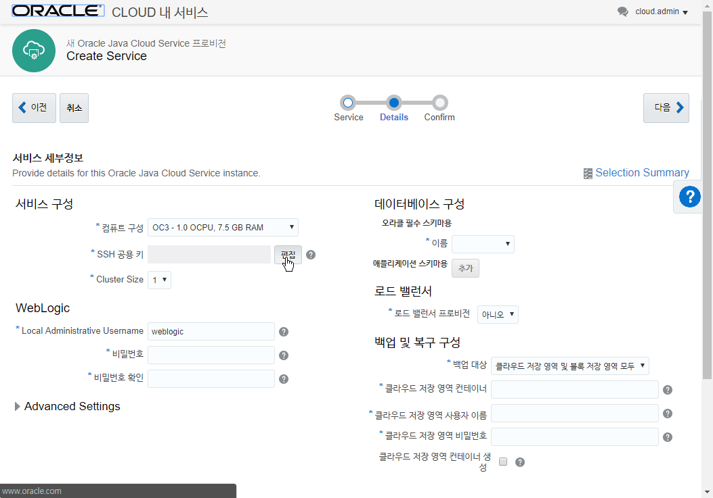
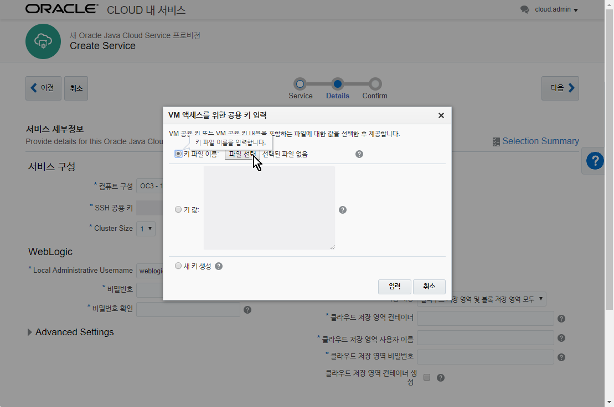

JCS 프로비저닝
==============

DB 프로비저닝이 완료되면, 다시 Dashboard로 돌아가서 Java Cloud Service를
클릭한다.

“Open Service Console”을 클릭해서 바로 콘솔을 열거나 “View Details”를
클릭후 “Open Service Console”을 클릭하여 콘솔을 연다.

{width="6.5in" height="2.79375in"}

“서비스 생성”을 클릭한다.

{width="6.5in"
height="3.2909722222222224in"}

“Java Cloud Service” 선택한다.

{width="3.197516404199475in"
height="1.8226891951006123in"}

아래와 같이 서비스의 이름을 “AlphaJCS”로 입력하고 나머지 사항은
기본값으로 사용한다.

-   서비스 이름 : AlphaJCS

{width="6.5in"
height="3.196527777777778in"}

“다음” 버튼을 누르면 세부항목 설정에 대한 화면이 나온다.

서비스 구성 영역에서 “SSL 공용 키”의 “편집”을 누른다.

{width="6.5in"
height="4.549305555555556in"}

다음과 같이 VM 액세스를 위한 공용 키 입력화면이 나타난다.

{width="6.5in"
height="4.319444444444445in"}

신규로 Public Key를 생성하거나, DBCS 프로비저닝 시에 생성한 Public Key를
업로드 한다. (DBCS 프로비저닝 시 다운로드 받은 zip 파일에는 privateKey와
publicKey가 들어있다. 이중 publicKey를 사용한다.)

{width="3.0in"
height="0.9895833333333334in"}

기존 생성한 Public Key를 업로드 하려면 다음과 같이 한다

“키 파일 이름”의 “파일선택”을 클릭하여 이전에 DBCS 프로비져닝 때
다운로드 받은 sshkeybundle.zip 파일에서 publicKey 파일을 선택하고 “입력”
버튼을 선택한다.

-   키 파일 이름 : publicKey

{width="6.5in"
height="4.319444444444445in"}

WebLogic 영역에서 비밀번호를 “Welcome1\#”으로 입력한다.

-   Local Administrative Username : weblogic

-   비밀번호 : Welcome1\#

-   비밀번호 확인 : Welcome1\#

그리고 Advanced Settings을 눌러 “관리 콘솔에 대한 액세스 사용”을 체크해
준다.

-   관리 콘솔에 대한 액세스 사용 : 체크

-   샘플 애플리케이션 배치 : 체크

{width="6.5in"
height="4.319444444444445in"}

데이터베이스 영역에서는 기존에 생성해 두었던 “AlphaDBCS”를 선택한다.

그리고 다음과 같이 입력한다.

-   PDB 이름 : PDB1

-   관리자 사용자 이름 : sys

-   비밀번호 : Welcome1\#

{width="6.5in"
height="4.319444444444445in"}

로드 밸런서 영역에서는 “예”로 선택하고 기본설정을 사용한다.

{width="6.5in"
height="4.319444444444445in"}

백업 및 복구 구성 영역에서는 다음과 같이 입력한다.

-   백업 대상 : 클라우드 저장 영역 및 블록 저장 영역 모두 (기본)

-   클라우드 저장 영역 컨테이너 :
    Storage-**identitydomain**/JCSContainer

-   클라우드 저장 영역 사용자 이름 : 클라우드 로그인 아이디

-   클라우드 저장 영역 비밀번호 : 클라우드 로그인 패스워드

-   클라우드 저장 영역 컨테이너 생성 : 체크

**identitydomain** 부분만 각자에게 할당된 identity domain으로 변경하면
된다

identity domain이 kroracle이라면 Storage-kroracle/JCSContainer 라고
입력하면 된다

{width="6.5in"
height="4.319444444444445in"}

모든 입력이 마쳤으면 상위의 “다음” 버튼을 누른다.

{width="6.5in"
height="4.319444444444445in"}

설정된 사항이 올바르면 “생성” 버튼을 누른다.

잠시 후, 다음과 같이 JCS 가 프로비져닝 되는 화면을 볼 수 있다.

{width="6.5in"
height="4.319444444444445in"}

JCS 프로비져닝은 약 20분 정도 소요된다.
