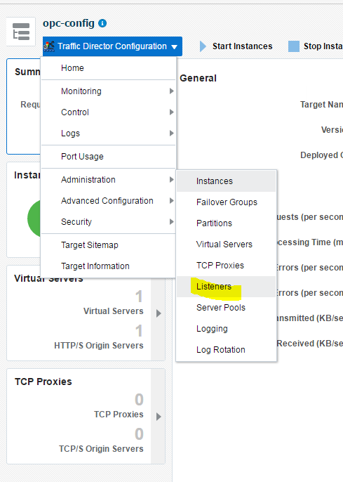

{width="2.55in" height="3.0in"}

[]{#_Toc488758086 .anchor}

> []{#_Toc488758267 .anchor}**100**
>
> **Java Cloud Service Workshop**

**July, 2017**

{width="6.040972222222222in" height="6.944444444444444e-3in"}목차
===================================================================================================

[*Introduction* 3](#introduction)

> [*Objectives* 3](#objectives)
>
> [*Required Artifacts* 3](#required-artifacts)
>
> [*Required Software* 3](#required-software)

[*Explore Java Cloud Service* 4](#explore-java-cloud-service)

> [***STEP 1:** Open WebLogic Console* 4](#step-1-open-weblogic-console)
>
> [***STEP 2:** Explore WebLogic Console*
> 10](#step-2-explore-weblogic-console)

[*Explore Oracle Traffic Director Console*
11](#explore-oracle-traffic-director-console)

> [***STEP 3:** Open Oracle Traffic Director Console*
> 11](#step-3-open-oracle-traffic-director-console)
>
> [***STEP 4:** Explore Traffic Director Console*
> 12](#step-4-explore-traffic-director-console)

[*Explore JCS image* 16](#explore-jcs-image)

> [***STEP 5:** Putty용 Private Key변환*
> 16](#step-5-putty용-private-key변환)
>
> [***STEP 6:** Explore JCS Image via SSH*
> 18](#step-6-explore-jcs-image-via-ssh)

{width="6.164583333333334in" height="0.3701388888888889in"}Introduction
=========================================================================================================

이 실습에서는 차세대 Oracle Java Cloud Service에 대한 개요를 습득하게
됩니다. 처음부터 새로운 Java Service 인스턴스를 생성 할 것입니다.
여러분은 서비스와 상호 작용할 수 있으며 연습을 통해 이 인스턴스로 작업
할 수 있는 모든 도구를 익힐 수 있습니다.

Objectives
----------

Java Cloud Service를 만들고 살펴보기

Required Artifacts
------------------

Database Cloud Service 프로비저닝

Java Cloud Service 프로비저닝

Required Software
-----------------

-   puttygen
    ([*https://the.earth.li/\~sgtatham/putty/latest/w64/puttygen.exe*](https://the.earth.li/~sgtatham/putty/latest/w64/puttygen.exe)
    : Windows 64bit)

-   putty
    ([*https://the.earth.li/\~sgtatham/putty/latest/w64/putty.exe*](https://the.earth.li/~sgtatham/putty/latest/w64/putty.exe)
    : Windows 64bit)

-   32비트는
    [*https://the.earth.li/\~sgtatham/putty/latest/*](https://the.earth.li/~sgtatham/putty/latest/)
    에서 다운로드 받으세요

Explore Java Cloud Service
==========================

[]{#page16 .anchor}Explore WebLogic Console

**STEP 1:** Open WebLogic Console
---------------------------------

Oracle Java Cloud Service가 보이지 않는다면, 데쉬보드에서 Java를
선택하여 Oracle Java Cloud Service의 Console을 여십시오.

{width="6.5in"
height="4.32017716535433in"}

“Java”를 클릭하면 Oracle Java Cloud Service에 대한 상세 상태가
나타납니다.

상위의 “Open Service Console”을 클릭하여 Oracle Java Cloud Service의
콘솔을 볼 수 있으며, 서비스 되고 있는 여러 인스턴스를 볼 수 있습니다.

{width="6.0in"
height="3.987179571303587in"}

JCS 콘솔에서는 현재 서비스 하고 있는 JCS의 인스턴스가 나타납니다.

이전에 만들었던 AlphaJCS가 현재 서비스 중에 있으며 WebLogic Console을
열기 위하여 AlphaJCS의 오른쪽에
있는{width="0.17473206474190725in"
height="0.15094378827646543in"}마크를 클릭하면 “WebLogic Service 콘솔
열기”가 나타납니다.

{width="6.0in"
height="3.987179571303587in"}

“WebLogic Server 콘솔 열기” 를 선택하면 다음과 같이 브라우저에서 보안에
관한 안내문이 나옵니다. 안내문은 브라우저의 종류에 따라 다릅니다.
(화면은 크롬 브라우저)

{width="6.0in"
height="3.987179571303587in"}

[]{#page17
.anchor}{width="6.040972222222222in"
height="6.944444444444444e-3in"}“고급” 을 눌러 WebLogic Server Console
로 이동을 하면 다음과 같이 로그인 화면이 나타납니다.

만약 FireFox라면 다음과 같이 화면에 나옵니다. “I Understand the Risks”를
확장하여 “Add Exception” 버튼을 누릅니다.

{width="3.910416666666667in"
height="2.7506944444444446in"}

“Confirm Security Exception” 버튼을 눌러 WebLogic Server Console 화면을
엽니다.

{width="3.73125in"
height="3.761111111111111in"}

다음과 같이 WebLogic Server Console 로그인 화면이 나옵니다.

{width="6.0in"
height="3.987179571303587in"}

JCS 인스턴스 생성 시 입력했던 사용자 이름과 비밀번호를 입력하고 “로그인”
버튼을 누릅니다.

-   사용자 이름 : **weblogic**

-   비밀번호: **Welcome1\#**

{width="3.721737751531059in"
height="1.8956517935258093in"}

로그인을 완료하면 WebLogic Server의 Console을 볼 수 있습니다.

**STEP 2:** Explore WebLogic Console
------------------------------------

Expand Domain Structure and click on **Environment &gt; Servers**.

{width="2.5833333333333335in"
height="2.6083333333333334in"}

Make note of the servers that have been created. Notice that there are
two servers, and the managed server belongs to a cluster.

{width="6.0in"
height="0.7534722222222222in"}

[]{#page19
.anchor}{width="6.040972222222222in"
height="6.944444444444444e-3in"}Now Click on **Clusters** from the
Domain Structure. In a following Lab we add a Node, and you will see
that the additional managed server will be added to this cluster.

{width="2.2305555555555556in"
height="0.85625in"}

{width="6.0in" height="0.85in"}

{width="6.164583333333334in" height="0.3701388888888889in"}Explore Oracle Traffic Director Console
====================================================================================================================================

**STEP 3:** Open Oracle Traffic Director Console
------------------------------------------------

As done previously, if you are not already on the **Java Cloud Service
Console** page, you can return by clicking on the **Consoles** drop down
found at the top right side of the screen.

Back on the JCS Instance page, click on
{width="0.28055555555555556in"
height="0.25in"} and select **Open Load Balancer** **Console.** As
before, add and confirm the exception if prompted by the browser.

{width="6.0in"
height="2.1319444444444446in"}

A new tab will open. Enter username and password and click **Login**

-   Username = **weblogic**

-   Password = **welcome1**

Note: JCS 인스턴스 생성시에 입력한 weblogic 사용자와 password를 사용하여
로그인

[]{#page20 .anchor}

{width="2.70625in"
height="1.4465277777777779in"}{width="6.040972222222222in"
height="6.944444444444444e-3in"}

**STEP 4:** Explore Traffic Director Console
--------------------------------------------

On the left hand side navigation panel click Instances

{width="5.477083333333334in"
height="2.886111111111111in"}

OTD Configuration 메뉴로 들어감

{width="4.948611111111111in"
height="2.810416666666667in"}

OTD 구성 선택

{width="5.14375in"
height="1.386111111111111in"}

OTD Instance가 Up상태인지 확인

{width="4.690972222222222in"
height="4.097916666666666in"}

Listener 메뉴 선택

{width="3.592361111111111in"
height="3.2569444444444446in"}

OTD configuration 은 8080 과 8081이 설정되어 있고, 디폴트로 8081이
enable이 되어 있다.

{width="6.001388888888889in"
height="1.0527777777777778in"}

왼쪽 navigation 판넬에서 Server Pools -&gt; origin-server-pool-1 를
클릭한다. Origin Servers를 선택한다.

{width="2.584722222222222in"
height="2.673611111111111in"}

{width="6.274305555555555in"
height="0.9541666666666667in"}

Origin-server-pool-1이 새로 생성한 JCS로 연결되었는지 확인한다.

{width="5.0472222222222225in"
height="2.529861111111111in"}

[]{#page21 .anchor}

{width="6.164583333333334in" height="0.3701388888888889in"}{width="6.040972222222222in" height="6.944444444444444e-3in"}Explore JCS image
=============================================================================================================================================================================================================

**STEP 5:** Putty용 Private Key변환
-----------------------------------

JCS 인스턴스로 접속을 하기 위해서는 SSH로 접속을 해야 한다. SSH로 접속을
하기 위해서는 private key가 필요한데, 이전에 DBCS 프로비저닝 때 생성된
private key를JCS 프로비저닝 때에도 사용하여 해당 private key를 사용하면
된다.

생성된 private key는 OpenSSH key로써 putty에서 사용하는 key와는 달라
putty를 사용하여 JCS 인스턴스에 접속학 위해서는 이 key를 변경할 필요가
있다.

먼저 key를 변경하기 위하여 puttyGen파일을 실행한다.

{width="3.7457403762029746in"
height="3.577522965879265in"}

DBCS나 JCS를 만들면서 생성한 Private Key (privateKey)파일 을 읽기 위해서
Menu에서 ConversionImport Key를 누른다.

아래와 같이 파일이 Load가 되면 Save Private Key를 눌러 ppk파일로
변환한다

{width="3.747823709536308in"
height="3.627665135608049in"}

Putty에서 해당 파일을 인증키로 사용하기 위해서 ConnectionSSHAuth 탭에서
위에서 저장한 .ppk 파일을 선택한다.

{width="4.143346456692913in"
height="3.969984689413823in"}

**STEP 6:** Explore JCS Image via SSH
-------------------------------------

Java Cloud Service 인스턴스 페이지에서, Admin Server 가상머신의 IP를
적어 둔다. **Java** **Service Console**에 가서 **AlphaJCS** 서비스를
클릭하면 이 정보를 볼 수 있다. 뒤에서 이 IP정보를 사용한다

{width="6.5in"
height="3.732638888888889in"}

기존에 Private Key를 설정한 putty에서 해당 IP로 접속한다.

{width="4.707744969378828in"
height="4.603591426071741in"}

접속이 완료되면 아이디에 “opc”를 입력한다.

login as : **opc**

{width="6.5in"
height="0.9916666666666667in"}

이제 WebLogic Server가 구동중인 virtual machine에 로그인을 한 상태이다.

Weblogic 프로세스는 oracle 계정으로 떠 있으므로 oracle 계정으로 switch를
해본다.

**sudo su – oracle **

{width="6.5in"
height="0.9916666666666667in"}

파일시스템을 확인하기 위해 df 명령를 실행해 본다. Weblogic이 설치된
경로와 Domain경로, jdk, backup 경로가 서로 다른 disk로 되어 있는 것을
확인할 수 있다.

**df **

{width="6.5in"
height="3.1805555555555554in"}

[]{#page23 .anchor}

{width="6.040972222222222in"
height="6.944444444444444e-3in"} **WebLogic Home** 으로 디렉토리를
옮겨서 weblogic이 설치되어 있는 것을 확인해보자.

**cd /u01/app/oracle/middleware**

**ls **

{width="6.5in"
height="1.2840277777777778in"}

WebLogic Domain 디렉토리에서도 AlphaJCS\_domain 가 생성된 것을 확인할 수
있다.

Note: 이전 단계에서 생성한 JCS 인스턴스 명의 도메인 확인

**cd /u01/data/domains**

**ls **

{width="6.5in"
height="1.2840277777777778in"}

이제 application을 deploy할 수 있는 WebLogic 엔진과 도메인이 구성된 전체
운영환경을 갖게 된 것이다.

이번 Lab은 여기까지 이다.
