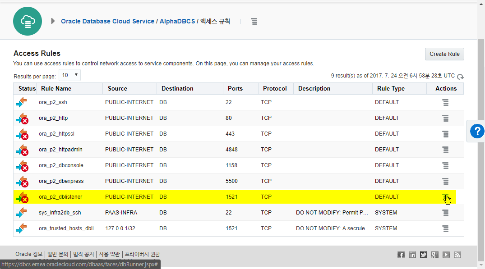
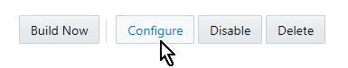
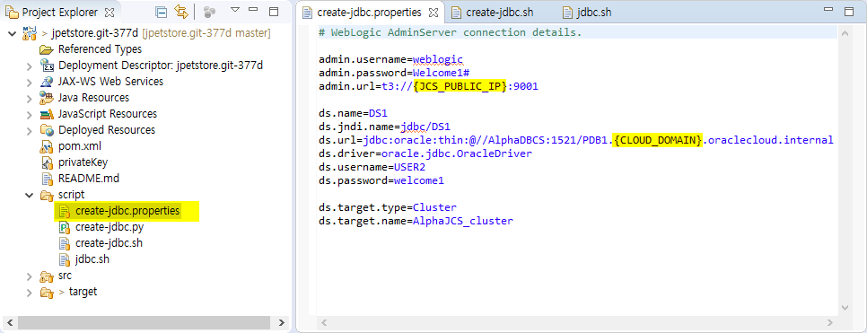
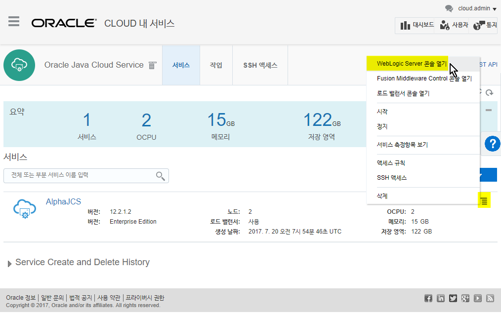
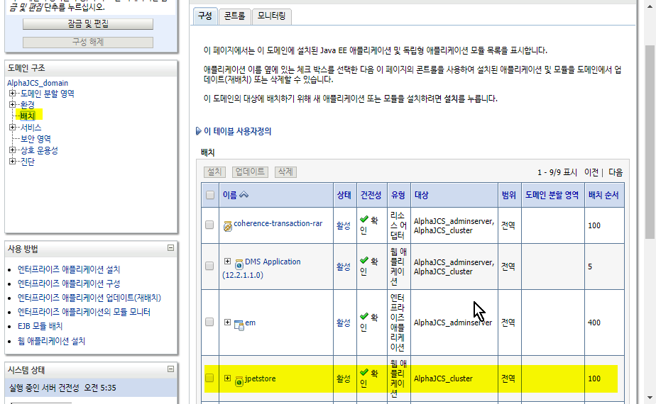
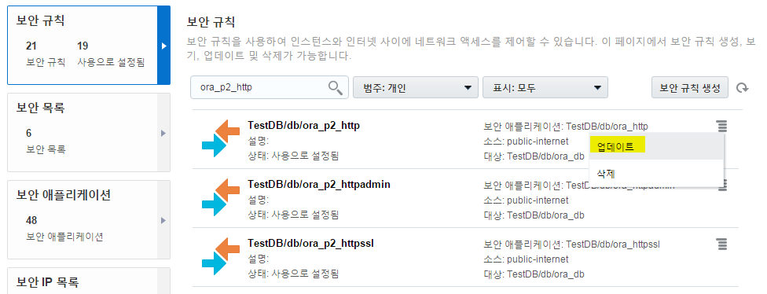
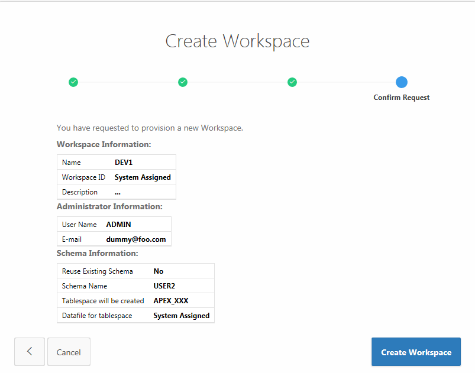
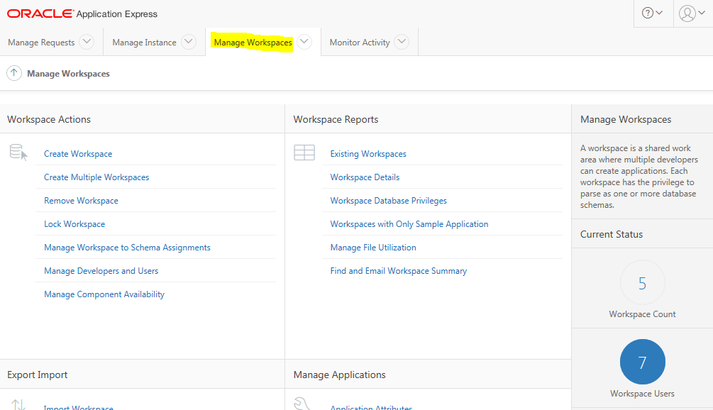

[]{#page2
.anchor}{width="6.040972222222222in"
height="6.944444444444444e-3in"}

{width="2.55in" height="3.0in"}

> []{#_Toc488758086 .anchor} []{#_Toc488758267 .anchor}**200**
>
> **Java Cloud Service Workshop**

**July, 2017**

목차
====

[*목차* 2](#목차)

[*Introduction* 3](#introduction)

> [*Objectives* 3](#objectives)
>
> [*Required Artifacts* 3](#required-artifacts)
>
> [*Required Software* 3](#required-software)

[*Flow* 4](#flow)

[*Java Cloud Service* 5](#java-cloud-service)

[*Database Cloud Service* 8](#database-cloud-service)

[*Developer Cloud Service* 10](#developer-cloud-service)

[*애플리케이션 배포 환경 준비* 15](#애플리케이션-배포-환경-준비)

> [*Eclipse 프로젝트 만들기* 15](#eclipse-프로젝트-만들기)
>
> [*DBCS 1521 포트 열기* 21](#dbcs-1521-포트-열기)
>
> [*DB 사용자 추가 및 테이블 만들기*
> 24](#db-사용자-추가-및-테이블-만들기)
>
> [*Private Key 추가* 30](#private-key-추가)
>
> [*애플리케이션을 위한 Data Source 추가하기*
> 34](#애플리케이션을-위한-data-source-추가하기)

[*애플리케이션 배포* 44](#애플리케이션-배포)

> [*애플리케이션 구성 파일 수정 (참고)*
> 44](#애플리케이션-구성-파일-수정-참고)
>
> [*DevCS를 통한 컴파일* 45](#devcs를-통한-컴파일)
>
> [*Developer Cloud Service를 이용한 애플리케이션 배포*
> 50](#developer-cloud-service를-이용한-애플리케이션-배포)

[*테스트* 57](#테스트)

[*별첨1 : Compute Cloud Service의 네트워크 보안 규칙 설정*
59](#별첨1-compute-cloud-service의-네트워크-보안-규칙-설정)

[*별첨2: APEX Workspace 생성 참고* 61](#별첨2-apex-workspace-생성-참고)

[*별첨3: DBCS에서의 Network Access Rule 설정*
71](#별첨3-dbcs에서의-network-access-rule-설정)

{width="6.164583333333334in" height="0.3701388888888889in"}Introduction
=========================================================================================================

이 문서에서는 JCS 인스턴스가 만들어 져 있는 상태에서 Developer Cloud
Service를 통하여 애플리케이션을 배포하는 방법에 대해 설명합니다.

Objectives
----------

Developer Cloud Service 의 프로젝트 생성

Developer Cloud Service 를 통한 애플리케이션의 배포

Required Artifacts
------------------

[]{#_Toc463983439 .anchor}Database Cloud Service 프로비저닝

Java Cloud Service 프로비저닝

CloudWorkshop\_LabGuide100\_kr\_v4

Required Software
-----------------

-   Oracle Enterprise Pack for Eclipse

([*http://www.oracle.com/technetwork/developer-tools/eclipse/downloads/index.html*](http://www.oracle.com/technetwork/developer-tools/eclipse/downloads/index.html))

Flow
====

Java Cloud Service를 이용하여 애플리케이션을 배포하는 과정은 일반적으로
다음과 같다. 이 문서에서는 아래 Flow중 Green으로 표시된 Step에 대해서만
상세히 다룰 것이다.

[]{#_Toc463983440 .anchor}

Java Cloud Service 
===================

Java Cloud Service는 cloud.oracle.com으로 접속하여 “My Service”로
로그인하여 접속하거나. 이미 서비스의 정보를 알고 있다면 제공하는
콘솔들에 직접 접속 할 수 있다. 이 문서에서는 Java Cloud Service 콘솔을
통한 접근, WebLogic Console에 직접 접근, Developer Cloud Service 접근
방법에 대해 다를 것이다.

JCS를 이미 신청했고 ID를 가지고 있다면 cloud.oracle.com의 “My Service”에
로그인한다.

Console 메뉴의 “Java Cloud Service”를 선택하면 사용 중인 JCS 인스턴스를
확인할 수 있다.

{width="6.5in"
height="3.7645833333333334in"}

{width="6.5in" height="2.84375in"}

생성된 인스턴스가 없다면 “서비스 생성” 버튼을 클릭하여 생성하면
된다(생성 과정은 이 문서에 포함하지 않는다).

생성된 서비스 도메인 명을 클릭하게 되면 도메인 상세 정보를 볼 수 있다.

{width="6.5in" height="2.84375in"}

Overview 페이지에서 아래와 같이 사용하고 있는 WebLogic Server 버전 및
생성된 인스턴스 명, VM의 Public IP 정보 등을 확인 할 수 있다.

첫 번째 VM에 Administration Server와 Managed Server 1개가 같이 구성되어
있고, 로드 밸런서가 다른 VM에 구성되어 있다.

{width="6.5in" height="4.875in"}

이후, 애플리케이션 배포를 위하여 다음의 공용IP를 기록해 두기로 한다.

{width="6.5in"
height="1.3881944444444445in"}

Database Cloud Service 
=======================

JCS와 마찬가지로 기존에 프로비저닝 했던 DBCS도 대시보드에서 접근해
보도록 한다.

{width="6.5in"
height="2.9194444444444443in"}

데시보드에서 Database를 클릭하여 DBCS 서비스를 본다.

{width="6.5in"
height="2.9194444444444443in"}

“Open Service Console”버튼을 클릭하여 DBCS 콘솔을 연다.

{width="6.5in"
height="2.9194444444444443in"}

“AlphaDBCS” 인스턴스를 클릭하면 상세한 인스턴스의 정보가 나온다.

{width="6.5in"
height="3.6395833333333334in"}

다음에 사용될 “공용 IP” 와 “접속 문자열” 을 기록해 둔다.

-   접속문자열 : **AlphaDBCS:1521/PDB1.도메인명.oraclecloud.internal**

Developer Cloud Service
=======================

앞서 말했었던 “데이터 로드”, “데이터 소스 생성”, “애플리케이션 배포” 에
해당하는 모든 것들이 Developer Cloud Service로 가능하다. 이를 위해
애플리케이션 배포를 위한 프로젝트를 만들어보도록 한다.

Developer Cloud Service 에 접근하는 방법은 기존의 JCS, DBCS와 동일하게
대시보드에서 접근 가능하다.

{width="6.5in" height="2.8875in"}

Developer Cloud Service를 클릭하면 상세한 정보가 나온다. “Open Service
Console”을 선택한다.

{width="6.5in" height="2.8875in"}

다음과 같이 Developer Console 이 열린다.

{width="6.5in"
height="2.6256944444444446in"}

위의 예제화면에는 기존에 구성되었었던 프로젝트들이 보인다. 처음
Developer Cloud Service를 사용한다면, 기존에 구성되어 진 프로젝트가
존재하지 않는다.

새로운 프로젝트를 만들기 위하여 “+ New Project”를 누른다.

{width="6.5in"
height="3.8333333333333335in"}

다음과 같이 새로운 프로젝트를 구성하기 위한 제목을 쓴다. 원하는 제목을
쓰면 된다.

-   Name : jpetstore

“Next”를 누르면 프로젝트를 구성할 템플릿이 나온다. 기존의 jpestore로
구성된 것을 읽어들이도록 하기 위해서 “Initial Repository”를 선택한다.

{width="6.5in"
height="3.8331649168853894in"}

“Next”를 누르고 “Import existing repository”를 선택한 다음 git 주소를
입력한다.

{width="6.5in"
height="3.7352154418197725in"}

-   [***https://github.com/OracleCloudKr/jpetstore.git***](https://github.com/OracleCloudKr/jpetstore.git)

“Finish” 버튼을 누르면 다음과 같이 프로젝트가 만들어지는 과정이
나타난다.

{width="6.5in"
height="3.7352154418197725in"}

프로젝트가 만들어 지면 다음과 같이 만든 jpetstore 프로젝트가 나타난다.

{width="6.5in"
height="3.7978226159230095in"}

프로젝트가 만들어지고 소스들이 복사되었지만 수정은 Developer Cloud
Service에서 할 수 없다. 소스 수정을 하려면 로컬에 eclipse를 설치 한 다음
방금 만든 git repository에서 소스를 가져온 다음 변경하고, 다시 변경한
소스를 git repository에 올려야 한다.

애플리케이션을 배포하기 위한 환경 준비과정을 살펴보기로 한다.

애플리케이션 배포 환경 준비
===========================

Eclipse 프로젝트 만들기
-----------------------

Oracle Homepage에서 다운로드 받을 수 있는 Oracle Enterprise Pack for
Eclipse (OEPE)는 eclipse에서 Oracle Developer Cloud Service를 사용
가능하게 연결해 준다.

Oracle Enterprise Pack for Eclipse 는 다음의 URL에서 다운로드 받을 수
있다.

-   [*http://www.oracle.com/technetwork/developer-tools/eclipse/downloads/index.html*](http://www.oracle.com/technetwork/developer-tools/eclipse/downloads/index.html)

eclipse 를 실행하면 다음과 같은 화면이 처음에 표시된다.

{width="6.5in"
height="4.777083333333334in"}

Oracle Developer Cloud Service에 접근하기 위해 다음과 같은 창을 연다.

Window &gt; Show View &gt; Other ..

{width="6.5in"
height="4.748611111111111in"}

Show View 라는 작은 창이 나타나는데, 여기서 Oracle Cloud 에게 접근 할 수
있는 창을 연다.

Oracle Cloud &gt; Oracle Cloud

{width="6.5in"
height="4.748611111111111in"}

선택을 하면 다음과 같은 화면이 나타난다.

{width="6.5in"
height="2.5972222222222223in"}

Oracle Cloud 화면에서 Connect 버튼을 누르면 Oracle Developer Cloud
Service에 접근 할 수 있는 도메인과 아이디, 패스워드를 입력할 수 있다.
자신이 가지고 있는 계정의 정보를 입력하면 된다.

{width="5.322251749781278in"
height="4.447361111111111in"}

입력을 하고 “Finish” 버튼을 누르면 다음과 같이 자신의 Developer Cloud
Service의 프로젝트들이 나타난다. 조금 전에 만든 jpetstore를 클릭하여
로컬에 git clone을 만든다.

{width="6.5in"
height="3.6430555555555557in"}

jpetstore.git-xxx 쪽에서 마우스 우클릭을 선택하여 “import project”를
선택한다.

{width="6.5in"
height="7.165972222222222in"}

선택을 하면 다음과 같은 화면이 나오고 “Finish” 버튼을 선택한다.

{width="6.5in"
height="4.272916666666666in"}

기존의 git repository에 저장된 프로젝트가 자신의 eclipse project로
import 된다.

우리는 이 import 된 프로젝트에서 수정을 하고 Oracle Developer Cloud
Service의 프로젝트에 소스를 업데이트 할 예정이다.

DBCS 1521 포트 열기
-------------------

DBCS로 접근하기 위해 외부에서 접근 가능한 1521 포트를 열어야 한다.

AlpahDBCS 인스턴스에서
{width="0.17565288713910762in"
height="0.15652230971128608in"}아이콘을 눌러서 나오는 메뉴 중 “액세스
규칙”을 선택한다.

“액세스 규칙”에서는 해당 DBCS 인스턴스에 접근규칙을 정할 수 있다.

{width="6.5in"
height="3.609722222222222in"}

“액세스 규칙”을 클릭하면 다음과 같은 화면이 보여진다.

{width="6.5in"
height="3.609722222222222in"}

리스트에서 Source 부분이 “PUBLIC-INTERNET” 이고 Ports 부분이 “1521” 인
부분인 것을 찾는다. 기본적으로 상태가 disable이라서 X 마크가 되어 있다.

이 부분을 오른쪽의
{width="0.17565288713910762in"
height="0.15652230971128608in"}을 눌러 Enable로 바꿔준다.

{width="1.1352744969378827in"
height="1.2081824146981628in"}

“Enable”을 선택하면 다음과 같이 Confirm 화면이 나온다. “Enable”을
선택한다.

{width="6.5in"
height="3.198611111111111in"}

“Processing..”을 알리는 화면이 나오고 난 뒤 끝나면 다음과 같이
PUBLIC-INTERNET에 대한 1521 포트가 열려졌음을 알 수 있다.

{width="6.5in"
height="3.198611111111111in"}

이로써 외부에서 1521 포트로 해당 DBCS에 접근이 가능하다.

DB 사용자 추가 및 테이블 만들기
-------------------------------

이제 앞서 연 1521포트를 통해 애플리케이션이 사용할 DB의 사용자 추가와
필요한 테이블을 생성하고 데이터를 로드 하는 작업을 시작할 수 있다.

DB 사용자 추가와 테이블 및 데이터 로드는 Developer Cloud Service의
SQLcl을 사용한다.

먼저 좌측의 메뉴에서 “Builder”를 클릭한다.

{width="2.5725951443569555in"
height="0.4791065179352581in"}

새로운 JOB을 만들기 위하여 “+ New Job” 버튼을 클릭한다.

{width="6.49657261592301in"
height="1.06956583552056in"}

제목을 입력한다.

{width="6.5in"
height="2.2715277777777776in"}

저장을 하고 나온 화면에서 소스를 선택하기 위해 ”Source Control”을
선택한다.

Source Control &gt; Git

{width="6.46923009623797in"
height="3.452174103237095in"}

Repository의 박스를 클릭하여 기존에 만든 jpetstore.git 을 선택한다.

{width="6.5in"
height="1.1597222222222223in"}

SQLcl을 수행하기 위하여 “Build Steps”을 선택하고”Add Build Step”을
누른다음 “Invoke SQLcl”을 선택한다.

Build Steps &gt; Add Build Step &gt; Invoke SQLcl

{width="6.5in"
height="3.8368055555555554in"}

사용자를 추가하는 SQL을 수행하기 위하여 다음과 같이 입력한다.

-   **Username : sys**

-   **Password : Welcome1\#**

-   **Connection String : **

**jdbc:oracle:thin:@//{DB공용IP주소}:1521/PDB1.{도메인명}.oraclecloud.internal**

-   **Source : SQL File**

-   **SQL File Path :
    src/main/resources/database/jpetstore-user-create.sql**

-   **Role : SYSDBA**

-   **Restriction Level : 0**

{width="6.5in"
height="2.9243055555555557in"}

또 Add Build Step &gt; Invoke SQL 을 선택 한 다음 테이블을 만들기 위해
다음과 같이 입력한다.

-   **Username : USER2**

-   **Password : welcome1**

-   **Connection String : **

**jdbc:oracle:thin:@//{DB공용IP주소}:1521/PDB1.{도메인명}.oraclecloud.internal**

-   **Source : SQL File**

-   **SQL File Path :
    src/main/resources/database/jpetstore-hsqldb-schema.sql**

-   **Role : Default**

-   **Restriction Level : 0**

{width="6.5in"
height="2.8784722222222223in"}

또 Add Build Step &gt; Invoke SQL 을 선택 한 다음 데이터를 로드하기 위해
다음과 같이 입력한다.

-   **Username : USER2**

-   **Password : welcome1**

-   **Connection String : **

**jdbc:oracle:thin:@//{DB공용IP주소}:1521/PDB1.{도메인명}.oraclecloud.internal**

-   **Source : SQL File**

-   **SQL File Path :
    src/main/resources/database/jpetstore-hsqldb-dataload.sql**

-   **Role : Default**

-   **Restriction Level : 0**

{width="6.5in"
height="2.9006944444444445in"}

모든 입력을 마쳤으면 오른쪽 위의 “SAVE”를 클릭한다.

{width="1.895596019247594in"
height="0.7290758967629046in"}

저장이 되면 “Build Now” 버튼을 눌러 실행 해 본다.

{width="6.5in"
height="0.4222222222222222in"}

빌드는 Queue에 넣어지고 바로 시작하게 된다. 빌드가 시작되면 Console의
버튼을 눌러 SQL이 수행되는 output을 볼 수 있다.

{width="5.343081802274716in"
height="1.0415365266841645in"}

{width="6.5in"
height="3.8368055555555554in"}

빌드가 성공적으로 수행되면 다음과 같이 Status에 녹색 체크마크의 성공이
표시된다.

{width="5.1764359142607175in"
height="0.9790441819772528in"}

만약 실패하면 Build가 실패했음을 알리는 X 마크가 표시된다. 그때에는
Console을 눌러 어떤 부분이 잘 못 되었는지 살펴보도록 한다.

{width="5.270174978127734in"
height="0.44786089238845145in"}

Build의 설정이 잘 못 되었을 시, Configure를 다시 한 번 살펴보기 바란다.

{width="4.009915791776028in"
height="0.7915682414698163in"}

Private Key 추가
----------------

다음 단계인 Data Source를 추가하기 위하여 이번 단계에서 Private Key를
서버에 추가해야 한다. Data Source는 JCS 인스턴스에 접근을 해서
스크립트를 실행하는 것이기에 Developer Cloud Service에서 JCS에 접속을
해야 한다. 이때 필요한 것이 Private Key 이다.

Private Key는 DBCS 프로비저닝 때 (혹은 JCS 프로비저닝 때) 다운로드 받은
sshkeybundle.zip 파일 안에 privateKey 라는 이름의 파일로 존재한다.

sshkeybundle.zip 압축파일을 풀고, privateKey 파일을 eclipse 의 Project
Explorer에서 해당 프로젝트의홈에에 카피하거나 탐색창에서 해당
workspace에 카피한다.

{width="6.217972440944882in"
height="3.572470472440945in"}

대화창이 나타나면 “Copy files”를 선택하여 privateKey를 복사한다.

{width="4.197391732283465in"
height="2.312211286089239in"}

다음과 같이 privateKey가 복사되었음을 알 수 있다.

{width="3.4474857830271217in"
height="2.489271653543307in"}

우리는 이 privateKey를 Developer Cloud Service에 올려야 한다. 현재 git
repository를 사용하고 있기 때문에 다음과 같이 Developer Cloud Service에
파일을 올리도록 한다.

먼저 commit 한다. Commit은 수정된 사항을 반영하겠다는 의미이다.

jpetstore.git 에서 오른쪽 클릭 &gt; Team &gt; Commit

{width="6.5in"
height="5.813888888888889in"}

Commit 를 클릭하면 다음의 창이 보인다.

Unstaged Changes 는 git repository에 저장하지 않는 항목들이고 Staged
Changes는 git repository에 저장하는 영역이다. 다음의 순서로 수행한다.

1.  Unstaged Changes 항목에서 privateKey 를 찾아 Staged Changeds
    영역으로 끌어 내린다

2.  Commit Message 에 “insert privatekey” 라고 코멘트를 써 준다

3.  “Commit and Push” 버튼을 누른다.

{width="6.5in"
height="2.817361111111111in"}

처리가 끝났따면 Developer Cloud Service에서 해당 privateKey가 commit
되어 있음을 볼 수 있다.

{width="6.5in"
height="3.3409722222222222in"}

이로써 DevCS가 JCS에 접근할 수 있게 되었다.

애플리케이션을 위한 Data Source 추가하기 
-----------------------------------------

JCS에 접근할 수 있는 PrivateKey를 업로드 하였기에 DevCS에서 JCS로
스크립트 파일을 업로드 해서 실행 할 수 있다.

WebLogic 환경에 Data Source를 등록은 WLST (WebLogi Script Tool)을
사용하여 등록하기로 한다.

WLST가 사용하는 스크립트는 script 디렉토리에 구성되어 있다.

{width="6.5in"
height="3.1104166666666666in"}

이 스크립트를 수행하기 위하여 다음과 같은 순서로 한다.

먼저 스크립트에서 자신의 JCS와 DBCS의 IP를 설정해 주어야 한다.

{width="6.5in"
height="2.4965277777777777in"}

왼쪽의 script/create-jdbc.properties 를 더블클릭 해서 파일을 연 다음
노란 부분의 값을 바꿔준다.

-   {JCS\_PUBLIC\_IP} 는 JCS의 공용 IP

-   {CLOUD\_DOMAIN}은 자신의 도메인

으로 수정한다.

JCS의 공용 IP가 기억나지 않는다면 앞 섹터의 Java Cloud Service를 확인 해
보도록 한다.

수정한 값을 Developer Cloud Service에 반영하기 위하여 git commit 를
한다.

{width="6.5in"
height="3.8180555555555555in"}

Git Staging 화면이 나타나면 Staged Changes에 create-jdbc.properties가
있는 지 확인 하고 “update properties”라고 메시지를 쓴 다음 “Commit and
Push” 버튼을 클릭한다.

{width="6.5in"
height="3.5180555555555557in"}

완료가 되면 Developer Cloud Service 에서 내용이 업데이트가 되었음을 알
수 있다.

{width="6.5in"
height="3.147222222222222in"}

이제 스크립트를 실행하는 작업을 해 보기로 한다.

DevCS에서 좌측의 Build 아이콘을 클릭한다.

{width="2.5725951443569555in"
height="0.4791065179352581in"}

기존에 만들어 놓은 “DB 사용자 생성 및 테이블, 데이터 로드” 가 보여진다.

{width="5.926342957130359in"
height="1.853934820647419in"}

“+ New Job”을 클릭하여 새로운 job을 생성한다.

Job Name 은 “Data Source 생성” 으로 한다. (다른 이름도 무관)

{width="6.5in"
height="2.4520833333333334in"}

저장을 하고 나온 화면에서 소스를 선택하기 위해 ”Source Control”을
선택한다.

Source Control &gt; Git

{width="6.5in"
height="3.861111111111111in"}

Repository의 박스를 클릭하여 기존에 만든 jpetstore.git 을 선택한다.

{width="6.5in"
height="1.1597222222222223in"}

WLST를 리모트에서 수행하기 위하여 Execute Shell을 선택한다.

Build Steps &gt; Add Build Step &gt; Execute Shell

{width="6.5in"
height="3.861111111111111in"}

다음과 같이 입력한다.

  ---------------------------------------------------------------------------------------------
  \#!/bin/sh
  
  scp -o StrictHostKeyChecking=no -i ./privateKey script/create-jdbc.\* opc@JCS주소:/tmp/
  
  ssh -o StrictHostKeyChecking=no -i ./privateKey opc@ JCS주소 "chmod +x /tmp/create-jdbc.sh"
  
  ssh -o StrictHostKeyChecking=no -i ./privateKey opc@ JCS주소 "/tmp/create-jdbc.sh"
  ---------------------------------------------------------------------------------------------

{width="6.5in" height="1.46875in"}

“SAVE” 버튼을 클릭하고 화면이 바뀌면 “Build Now”버튼을 클릭한다.

진행되는 로그를 보면 다음과 같이 성공적으로 수행이 끝났다고 나오면 된다.

{width="6.5in"
height="3.942361111111111in"}

[]{#_Toc348963858 .anchor}스크립트가 종료된 후 생성된 데이터 소스를
확인하기 위해 WebLogic Console에 접속한다.

{width="6.5in"
height="4.076388888888889in"}

Provision 시에 사용한 weblogic 계정과 패스워드(weblogic / welcome1)을
입력한다.

{width="3.923611111111111in"
height="2.1527777777777777in"}

왼쪽 메뉴에서 서비스데이터 소스 를 선택한다.

{width="6.5in"
height="4.552777777777778in"}

‘모니터링’ 탭을 눌러 서비스가 정상적으로 Running인 것을 확인한다.

{width="6.5in"
height="3.272222222222222in"}

[]{#_Toc463983450 .anchor}

애플리케이션 배포
=================

애플리케이션 구성 파일 수정 (참고)
----------------------------------

Note : “JCS 교육 과정”에서는 아래 내용들이 이미 반영되어있는
jpetstore.war를 제공할 것이므로 아래 내용은 참조만하면 된다.”

샘플로 사용하는 JPetStore 애플리케이션은 HyperSQL을 사용하는 예제 이므로
참조하는 DataSource 객체가 WebLogic의 Data Source를 JNDI를 통해서
참조하는 형태로 다음과 같이 수정되어 있다.

  -----------------------------------------------------------------------------------------
  src\\main\\webapp\\WEB-INF\\ applicationContext.xml
  -----------------------------------------------------------------------------------------
  &lt;bean id="**dataSource**" class="org.springframework.jndi.JndiObjectFactoryBean"&gt;
  
  &lt;property name="jndiName" value="java:comp/env/**ds1**" /&gt;
  
  &lt;/bean&gt;
  -----------------------------------------------------------------------------------------

DataSource의 레퍼런스 참조를 만들기 위해 web.xml과 weblogic.xml에 다음과
같이 되어 있다.

  -------------------------------------------------------
  web.xml
  -------------------------------------------------------
  &lt;resource-ref&gt;
  
  &lt;res-ref-name&gt;**ds1**&lt;/res-ref-name&gt;
  
  &lt;res-type&gt;javax.sql.DataSource&lt;/res-type&gt;
  
  &lt;res-auth&gt;Container&lt;/res-auth&gt;
  
  &lt;/resource-ref&gt;
  -------------------------------------------------------

샘플 애플리케이션에 weblogic.xml을 다음과 같이 설정해서 추가했다.

  --------------------------------------------------
  weblogic.xml
  --------------------------------------------------
  &lt;resource-description&gt;
  
  &lt;jndi-name&gt;jdbc/DS1&lt;/jndi-name&gt;
  
  &lt;res-ref-name&gt;**ds1**&lt;/res-ref-name&gt;
  
  &lt;/resource-description&gt;
  --------------------------------------------------

샘플 애플리케이션에서 사용하는 Spring 버전과 JCS의 기본 탑재되어 있는
Spring 버전이 다르기 때문에, 애플리케이션의 라이브러리를 사용하도록 하기
위해 prefer-application-packages를 설정해야 한다. 완성된 weblogic.xml은
다음과 같다

  ------------------------------------------------------------------------------------------------------------------------------------------------------------------------------------------------------------------------------------------------------------------------------------------------------------------------------------------------------------------------------------
  weblogic.xml
  ------------------------------------------------------------------------------------------------------------------------------------------------------------------------------------------------------------------------------------------------------------------------------------------------------------------------------------------------------------------------------------
  &lt;?xml version="1.0" encoding="UTF-8"?&gt;
  
  &lt;wls:weblogic-web-app xmlns:wls="http://www.bea.com/ns/weblogic/weblogic-web-app" xmlns:xsi="http://www.w3.org/2001/XMLSchema-instance" xsi:schemaLocation="http://java.sun.com/xml/ns/javaee http://java.sun.com/xml/ns/javaee/web-app\_2\_5.xsd http://www.bea.com/ns/weblogic/weblogic-web-app http://www.bea.com/ns/weblogic/weblogic-web-app/1.0/weblogic-web-app.xsd"&gt;
  
  &lt;wls:context-root&gt;jpetstore&lt;/wls:context-root&gt;
  
  &lt;resource-description&gt;
  
  &lt;jndi-name&gt;jdbc/DS1&lt;/jndi-name&gt;
  
  &lt;res-ref-name&gt;**ds1**&lt;/res-ref-name&gt;
  
  &lt;/resource-description&gt;
  
  &lt;wls:container-descriptor&gt;
  
  &lt;wls:prefer-application-packages&gt;
  
  &lt;wls:package-name&gt;org.springframework.\*&lt;/wls:package-name&gt;
  
  &lt;/wls:prefer-application-packages&gt;
  
  &lt;/wls:container-descriptor&gt;
  
  &lt;/wls:weblogic-web-app&gt;
  ------------------------------------------------------------------------------------------------------------------------------------------------------------------------------------------------------------------------------------------------------------------------------------------------------------------------------------------------------------------------------------

Maven을 통해 애플리케이션을 빌드하고 패키징 한 파일이 VM안에 있는 oracle
계정의 홈에 jpetstore/jpetstore.war에 있다.

DevCS를 통한 컴파일
-------------------

DevCS에서 좌측의 Build 아이콘을 클릭한다.

{width="2.5725951443569555in"
height="0.4791065179352581in"}

기존에 만들어 놓은 “DB 사용자 생성 및 테이블, 데이터 로드” 및 “Data
Source 생성” job이 보여진다.

{width="6.5in"
height="1.5159722222222223in"}

“+ New Job”을 클릭하여 새로운 job을 생성한다.

Job Name 은 “jpetstore 어플” 으로 한다. (다른 이름도 무관)

{width="6.5in"
height="2.295138888888889in"}

저장을 하고 나온 화면에서 소스를 선택하기 위해 ”Source Control”을
선택한다.

Source Control &gt; Git

Repository의 박스를 클릭하여 기존에 만든 jpetstore.git 을 선택한다.

{width="6.5in"
height="4.608333333333333in"}

컴파일 하기 위해서 “Build Step”에서 “Maven 3” 를 추가한다.

{width="6.5in"
height="4.319444444444445in"}

“Invoke Maven 3”를 선택하면 다음과 같이 설정사항이 만들어진다.

디폴트로 해도 컴파일이 될 것 이다.

{width="6.5in"
height="4.733333333333333in"}

컴파일이 되고 난 후에 Deploy할 대상을 추려내는 작업을 해보도록 한다.

“Post Build”를 선택한다.

“Archive the artifacts”를 선택하여 target/jpetstore.war 를 입력한다.

{width="6.5in"
height="5.131944444444445in"}

“SAVE” 버튼을 클릭하여 저장하고 “Build now”를 선택한다.

컴파일이 완료되면 성공하면 다음과 같이 화면 우측 상단에
target/jpetstore.war를 볼 수 있다.

{width="6.5in"
height="4.733333333333333in"}

jpetstore.war는 클릭하여 다운로드 받을 수 있다.

배포는 Developer Cloud Service를 통하여 Java Cloud Service에 배포가
가능하고 혹은 war 파일을 직접다운로드 받은 후 WebLogic Console을 통하여
배포도 가능하다.

Developer Cloud Service를 이용한 애플리케이션 배포
--------------------------------------------------

먼저 Developer Cloud Service 콘솔에서 “Deploy” 를 선택한다.

{width="2.603840769903762in"
height="1.458150699912511in"}

“New Configuration”을 선택한다.

{width="4.759821741032371in"
height="2.239303368328959in"}

다음과 같이 입력한다.

-   Configuration Name : **jpetstore** (다른 이름도 가능)

-   Application Name : **jpetstore** (다른 이름도 가능)

-   Deployment Target : **“Java Cloud Service..” 선택**

{width="6.5in"
height="4.034027777777778in"}

JCS에 접근하기 위한 팝업 화면이 나타나면 다음과 같이 입력한다.

-   Version : **Oracle Weblogic Server 12c (12.2.x or higher)**

-   Protocol : **Oracle WebLogic RESTFul Management Internface**

-   Host : **JCS 의 공용 IP**

-   HTTPS Port : **7002**

-   Username : **weblogic**

-   Password : **Welcome1\#**

{width="6.5in"
height="4.0159722222222225in"}

“Find Targets”을 선택하면 다음과 같이 배포대상이 나타난다.

{width="6.5in"
height="4.0159722222222225in"}

Clusters 쪽의 AlphaJCS\_cluster를 체크하고 OK를 누른다.

{width="6.5in"
height="4.238888888888889in"}

-   Type : **On Demand**

-   Job : **jpetstore 어플**

-   Build : **Success 한 빌드**

-   Artifact : **target/jpetstore.war**

입력을 모두 마친 다음 “Save and Deploy”를 선택한다.

그러면 target/jpetstore.war를 자신이 지정한 JCS 인스턴스로 배포를 하기
시작하고, 완료된 후 다음과 같은 화면을 보여준다.

{width="6.5in"
height="4.238888888888889in"}

최종적으로 WebLogic 콘솔에서 확인 해 보면 jpetstore가 배포되어서
동작하고 있음을 알 수 있다.

{width="6.5in"
height="4.009722222222222in"}

[]{#_Toc463983453 .anchor}

테스트
======

배포된 애플리케이션을 테스트하기 위해서는 애플리케이션이 배포된 JCS의
Public IP를 통해 접속 하거나, Load balancer가 구성되어 있다면 Load
Balancer의 Public IP를 통해서 테스트 하면 된다. (Port Forwarding을
설정해 두었다면, localhost로도 테스트 해볼 수 있다. )

Load Balancer의 Content endpoint를 통한 접속 : https://Load Balancer
Public IP/

{width="6.5in"
height="4.670833333333333in"}

참고) content endpoint의 sample-app는 JCS인스턴스 프로비저닝 시에 sample
app를 배포하는 옵션을 선택하였기 때문에 기본적으로 배포되어 있는
애플리케이션이다.

배포된 jpestore는 /jpetstore 라는 context를 가지기에 다음과 같이 접속할
수 있다.

-   **https://로드밸런서\_공용\_IP/jpetstore**

{width="6.495652887139108in"
height="1.9913035870516185in"}

{width="6.5in"
height="4.573611111111111in"}

[]{#_Toc463983454 .anchor}

별첨1 : Compute Cloud Service의 네트워크 보안 규칙 설정
=======================================================

Oracle Public Cloud Portal을 통해 접속하는 Console들이 브라우저를 통해
접근이 되지 않을 경우는 Console 서비스들이 사용하는 포트가 Network
Access Rule에 의해 막혀 있기 때문이므로, 아래 표에 기술한 포트들을
Compute Cloud Service의 Console을 통해서 열어주면 된다.

  사용 Application                         Protocol/Ports   Security Rules
  ---------------------------------------- ---------------- ----------------------
  EM Console                               TCP/5500         ora\_p2\_dbexpress
  APEX(Application Express Console)        TCP/80           ora\_p2\_http
  WebLogic Console (HTTPS)                 TCP/7002         ora\_p2admin\_ahttps
  Oracle Traffic Director Console(HTTPS)   TCP/8989         ora\_p2otd\_ahttps

Dashboard &gt; Compute Cloud Service&gt; 서비스 콘솔 열기

{width="6.5in"
height="1.4791666666666667in"}

네트워크 탭으로 이동하여 Accept할 보안 규칙을 선택하여 엑세스가 허용
혹은 차단되어있는지 확인한다.(아래 예에서 ora\_p2\_http는 APEX 콘솔에서
사용하는 포트이다)

{width="6.5in"
height="3.0361450131233596in"}

차단되어 있다면 우측 메뉴를 클릭하여 “업데이트”를 선택한다.

{width="6.5in"
height="2.4879516622922133in"}

업데이트 창에서 “상태”를 “사용으로 설정됨”으로 변경 후 업데이트 한다.

{width="5.020833333333333in"
height="3.7430555555555554in"}

{width="0.3402777777777778in"
height="0.3194444444444444in"}이런 모양의 아이콘이
{width="0.3055555555555556in"
height="0.3055555555555556in"}이렇게 변경되었다면 접근이 허용된 것이다.
접근을 허용할 다른 포트들도 이와 같은 방법으로 설정하면 된다.

[]{#_Toc463983455 .anchor}

별첨2: APEX Workspace 생성 참고
===============================

APEX Console 열기 (처음 접속 시는 포트(80)이 Network Access Rule로 Deny
되어 있는 상태이므로 별첨3의 “DBCS에서의 Network Access Rule 설정”을
참조하여 Access Rule을 수정한다)

{width="6.5in" height="1.43in"}

INTERNAL workspace에 접속한다. 계정은 ADMIN이고 초기 패스워드는 DBCS를
생성할 때의 sys 패스워드이다. 초기 로그인 후 패스워드를 변경해 주게
되어있으므로, 이미 변경했다면 sys 패스워드가 아닐 수 있으니 잘 기억해
두고 로그인 한다.

{width="3.576388888888889in"
height="3.6875in"}

개발 작업에 사용할 Workspace를 신규로 생성한다.

{width="6.5in"
height="1.1907895888013997in"}

Workspace 이름을 주고 Next를 클릭한다.

{width="4.527777777777778in"
height="3.1805555555555554in"}

새로운 Schema를 생성하여 이 workspace에서 사용하도록 할 것이다. 여기서
schema란 DB의 사용자를 말한다. 패스워드를 입력하고 Next를 클릭한다.

{width="6.0in"
height="3.9791666666666665in"}

ADMIN 계정과 패스워드를 입력하고 Next를 클릭한다.

{width="6.104166666666667in"
height="3.8055555555555554in"}

입력한 정보를 확인하고 “Create Workspace”를 클릭한다.

{width="6.138888888888889in"
height="4.819444444444445in"}

Workspace가 생성 되었다.

{width="6.097222222222222in"
height="3.548611111111111in"}

다음 단계에서는 새로 생성할 Workspace에서 사용할 사용자를 생성할 것이다.
이 사용자는 DB의 계정이 아니고 Workspace에 로그인하기 위한 사용자이다.

“Manage Workspaces” 탭에서 Workspace Users를 클릭한다.

{width="6.5in"
height="3.729187445319335in"}

새로운 사용자를 생성하여 Workspace에 매핑할 것이다. “Create User”를
클릭한다.

{width="6.5in"
height="2.676078302712161in"}

다음 표시된 부분을 입력하고 “Create User”를 클릭한다.

{width="6.5in"
height="7.181673228346456in"}

{width="6.5in"
height="1.640508530183727in"}

이제 INTERNAL Workspace에서 로그아웃하여 새로 생성한 Workspace에
로그인해보자

{width="5.180555555555555in"
height="2.1805555555555554in"}

새로 생성한 Workspace 이름과 Workspace 사용자 명을 입력하고 로그인 한다.

{width="3.048611111111111in"
height="3.3402777777777777in"}

로그인 후 패스워드를 변경하는 화면이 출력되면 변경하고 로그인 한다.

다음과 같은 화면에 접속되면 완료된 것이다.

{width="6.5in"
height="2.602409230096238in"}

[]{#_Toc463983456 .anchor}

별첨3: DBCS에서의 Network Access Rule 설정
==========================================

DBCS 인스턴스를 선택하여 서비스 콘솔로 들어간다.

{width="6.5in"
height="1.3060181539807525in"}

메뉴에서 “Access Rule” 선택

{width="5.819444444444445in"
height="3.7222222222222223in"}

ora\_p2\_httpssl 룰을 Enable 해준다

{width="6.5in"
height="2.69629593175853in"}

{width="6.5in"
height="2.6180555555555554in"}

Enable 된 것을 확인한다.

{width="6.5in"
height="2.6084339457567802in"}
