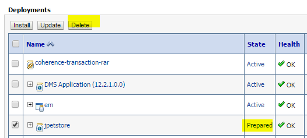
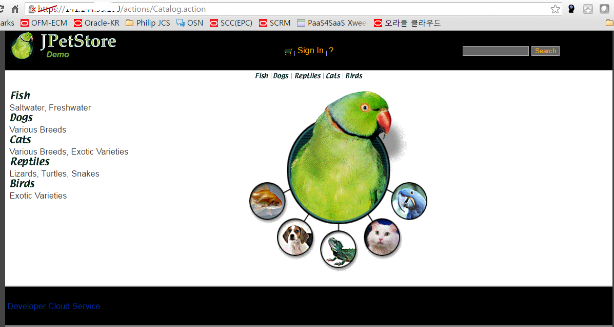
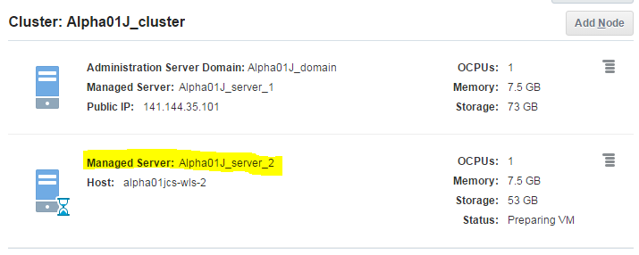
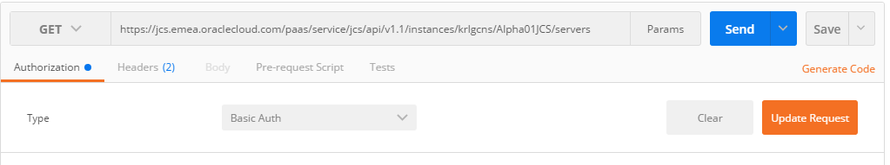

[]{#page1 .anchor}

> **300**
>
> **Java Cloud Service Workshop**

September, 2016

[]{#page2 .anchor}*Page /300 – 2*
*Oracle Confidential* *Cloud Services*

**Introduction**

In this lab you will learn how to backup your Java Cloud service using
the Java Cloud Administration console. You will also learn how to
restore your Cloud Service using that backup. You will also learn how to
use the Java Cloud Service integrated Cloud UI to scale-up the Java
Cloud Service by adding an additional node. You’ll remove that node
(scale-down) programmatically using the administration REST APIs.

**Objectives**

> Backup the Java Cloud Service to a Storage Service
>
> Scale-up the Java Cloud Service’s WebLogic Server by requesting
> additional Node
>
> Scale-down the WebLogic Server by removing a Node. Restore the Java
> Cloud Service from a Backup

**Required Artifacts**

> The following labs assume that the steps outlined in lab guide 200
> have been completed.

**Outline**

> **Introduction** **2**
>
> Objectives 2
>
> [Required Artifact](#page2)s 2
>
> Outline 2
>
> **[Operation Task](#page3)s** **3**
>
> [Backup the Java Cloud Servic](#page3)e 3
>
> [Restore from Backu](#page5)p 5
>
> [Request Additional Node](#page9)s 9
>
> [Remove node](#page12)s [1](#page12)2

[]{#page3 .anchor}

**Operation Tasks**

**Backup the Java Cloud Service**

**STEP 1:** Create Backup of JCS

From the **Console** dropdown, select the **Java Cloud Service**

Click on **Alpha01JCS** to go to the instance dashboard.

Click on the **ADMINISTRATION** Group

[]{#page4 .anchor}

Click on the **Back Up Now** Button

> Use the defaults, but enter a note **Post application deployment
> backup** and click on the **Back Up** Button

[]{#page5 .anchor}

> The backup is now running. You can click the refresh
>  icon to monitor the progress.

> Wait for the backup to complete – the hourglass icon will no longer
> appear when the backup is complete.

백업이 진행 중이고 JCS 아이콘이 Maintenance 생태로 변경된다.

JCS 인스턴스가 Maintenance 상태여도 애플리케이션은 정상적으로 동작된다.
브라우저 탭을 하나 더 열어 애플리케이션을 테스트 해본다. Lab2에서 배포한
App으로 테스트 하거나 샘플로 배포되어 있는 애플리케이션으로 테스트 하면
된다.

백업이 완료되었는지 확인한다.

**Restore from Backup**

**STEP 2:** Delete Application

> Prior to doing the restore, we are going to go into WebLogic console
> and remove the application that we have been deployed. When we do the
> restore, we will see that the Application is once again available.

참고 : 이전 LAB에서 배포한 JPetstore 애플리케이션을 삭제한다.

Open WebLogic Console, click **Lock & Edit**, and then go to
**Deployments**. Select

> **jpetstore** and click **Stop -&gt; Force Stop Now **

[]{#page6 .anchor}

Click **Yes**

Now select **jpetstore** and click **Delete**.

Click **Yes**

[]{#page7 .anchor}

Now click **Activate Changes**.

> Verify that the **jpetstore** application is NOT working by entering
> the URL used previously in the lab. This is the URL that was copied as
> a bookmark.

JPetstore 애플리케이션을 수행해보고 애플리케이션이 삭제되어 Not Found가
나오는지 확인한다.

**STEP 3:** Restore Java Cloud Service from Backup

Back on the JCS instance dashboard. Click on **ADMINISTRATION**

On your most recent backup, click 
and select **Restore**.

[]{#page8 .anchor}

Click the **Restore** Button

On final confirmation screen click **Yes, Restore Instance**

> Click refresh  to monitor the
> progress. Restore may take more than 20 minutes.

[]{#page9 .anchor}

> Once the restore is completed, verify that the **jpetstore**
> application is working by entering the URL used previously in the lab
> to accesses the Product Catalog REST APIs. This is the URL that was
> copied as a bookmark.

Restore 후에 다시 JPetstore 애플리케이션을 실행하여 잘 수행되는지
확인한다.

**Request Additional Nodes**

**STEP 4:** Request Additional WebLogic Managed Server

> Click on **TOPOLOGY** Group to initiate the Scale-up activity. **Make
> note** that there are **2 nodes** in the Topology and the Load
> Balancer is enabled.

Click **Add Node** to add another managed server to the
**Alpha01J\_cluster**

Click on the **Add Node** button to start the process.

[]{#page10 .anchor}

> Expand the **Scaling Activity** list, and you will now see that the
> status has changed to **In Progress** or **Adding…**

Click refresh  to monitor the
progress.

확장 중에도 애플리케이션을 정상적으로 서비스된다. Jpetstore
애플리케이션을 이용하여 서비스가 정상 동작하는지를 확인한다.

Continue to monitor the progress and wait until the Topology indicates
that there

> are 3 Nodes, the Load Balancer is once again enabled, and the
> Alpha01JCS instances no longer contains the warning indicator
>  in its icon. This process can take
> about 20 minutes.

신규 Node가 추가되고 있는 것을 확인할 수 있다

[]{#page11 .anchor}

> Once the additional node has been added, the Alpha01JCS icon will
> return to normal.

> Now let’s navigate to the Compute Cloud Service. From the **Consoles**
> dropdown select **Compute Cloud Service**.

[]{#page12 .anchor}

You will now see an addition virtual machine with the name **Alpha01JCS
wls 2**

**Remove nodes – (Option)**

**STEP 5:** WebLogic Managed Server 삭제

> Node 삭제는 Cloud UI 콘솔에서 수행할 수 있다.
>
> 이 Lab은 개발자나 운영자들이 REST API를 program적으로 활용하여 사용할
> 경우를 위한 단계이므로 선택적으로 수행한다.
>
> Firefox의 REST Client 나 Google의 Postman또는 cURL을 이용하여 REST
> 테스트를 실행하면 된다. 여기에서는 Google의 Postman을 이용할 것이다.
> Google Postman은 다음에서 받을 수 있다.
>
> [*https://chrome.google.com/webstore/detail/postman/fhbjgbiflinjbdggehcddcbncdddomop*](https://chrome.google.com/webstore/detail/postman/fhbjgbiflinjbdggehcddcbncdddomop)
>
> REST API 관련 정보 확인
>
> 
>
> 
>
> Chrome의 Postman을 사용하거나 cURL 유틸리티를 사용하여 다음 REST API를
> 실행한다.

각 계정의 JCS 기본 REST Endpoint 확인

Endpoint 예: https://jcs.emea.oraclecloud.com/

서버정보 조회

/paas/service/jcs/api/v1.1/instances/{identityDomainId}/{serviceId}/servers

URL :
https://jcs.emea.oraclecloud.com/paas/service/jcs/api/v1.1/instances/XXXXX/Alpha01JCS/servers

Method : GET

[]{#page13 .anchor}

First we will send a GET request to view all the server details. Click
**Authentication** and select **Basic Authentication **

Enter the following information and click **Okay**

> Username = **&lt;your Account user name &gt;** Password = **&lt;your
> password&gt;**

> Next we will add a custom header property. Click **Headers** in drop
> down, and select **Custom Header.** Enter the following information
> and click **Okay**
>
> Name = **X-ID-TENANT-NAME**
>
> Value = **&lt;your domain Id&gt;**

Now enter the following URL and click **Send**.

Click on **Response Body (highlight)** to see the results.

> Now change the Operation from **GET** to **DELETE** and add the
> specific server to remove at the end of the URL. Click **SEND**

서버 노드 삭제

/paas/service/jcs/api/v1.1/instances/{identityDomainId}/{serviceId}/servers/{name}

URL 예 :
https://jcs.emea.oraclecloud.com/paas/service/jcs/api/v1.1/instances/xxxx/Alpha01JCS/servers/Alpha01J\_server\_2

Method : DELETE

X-ID-TENANT-NAME 헤더 추가

Click on **Response Body (highlight)** to see the results.

Delete Job의 수행 상태 확인

/paas/service/jcs/api/v1.1/instances/{identityDomainId}/status/{requestName}/job/{jobId}

위의 response에서 jobId를 이용하여 다음 URL 수행

예:
https://jcs.emea.oraclecloud.com/paas/service/jcs/api/v1.1/instances/XXXX/status/delete/job/2074785

> Return to the Java Cloud Service dashboard, and you will see that the
> service is in Maintenance mode as the node is being removed.

> After several minutes, the Alpha01JCS will no longer be in Maintenance
> mode, and the node will be removed from the instance dashboard.

This Lab is completed
