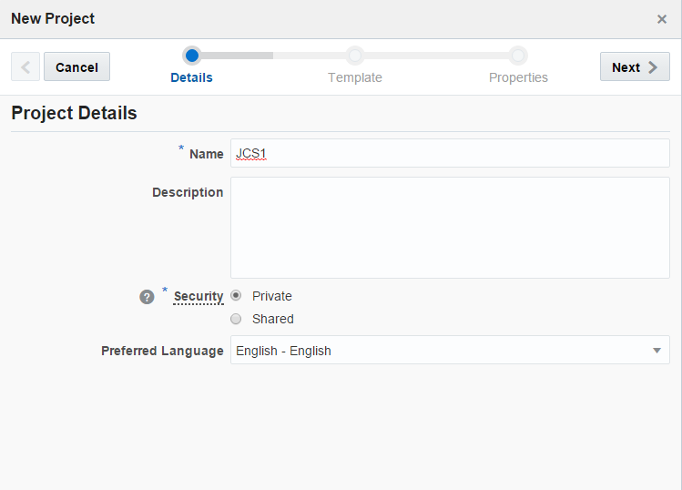
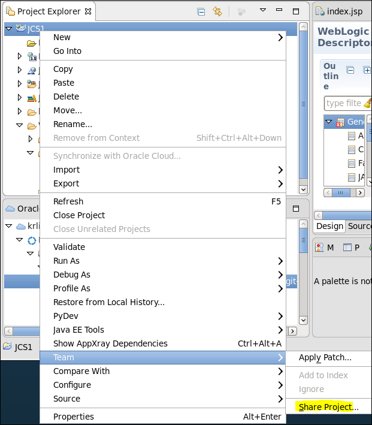

{width="2.55in" height="3.0in"}

> **401 **
>
> **Java Cloud Service Workshop**

September, 2016

{width="6.040972222222222in"
height="6.944444444444444e-3in"}
{width="6.164583333333334in"
height="0.3701388888888889in"}

**Introduction**

이 Lab에서는 Oracle Developer Cloud Service를 기본적으로 사용해 보는
실습을 수행할 것이다. Oracle Developer Cloud Service와 integration되어
있는 OEPE(Oracle Enterprise Pack for Eclipse)를 이용해 Project를 생성한
후 Developer Cloud Service에 소스를 배포하고 자동화된 build를 수행한 후
Java Cloud Service로 packaging된 Application을 Deploy하는 과정을
실습한다.

**Objectives**

> Developer Cloud Service 와 OEPE 의 Project 생성, Build, Deploy

**Required Artifacts**

> 이 Lab은 OEPE(Oracle Enteprise Pack for Eclipse) 필요
>
> [*http://www.oracle.com/technetwork/developer-tools/eclipse/downloads/index.html*](http://www.oracle.com/technetwork/developer-tools/eclipse/downloads/index.html)

**Outline**

> [**OEPE와 Developer Cloud Service 사용하기**](#OEPE) **3**
>
> [Developer Cloud Service 생성하기](#DEVCS생성하기) [3](#page19)
>
> [Eclipse Project 생성하기](#EclipseProject생성하기) [5](#page19)
>
> [Oracle Cloud 연결하기](#OracleCloud연결하기) [7](#page19)
>
> [Developer Cloud Service 로 OEPE Project
> 내보내기](#DEVCS로OEPE내보내기) 8
>
> [Developer Cloud Service 에서 build 하기](#DEVCS에서build하기) 10
>
> [Developer Cloud Service 에서 JCS에
> Deploy하기](#DEVCS에서JCS에Deploy하기) 13
>
> [Build & Deploy 자동화하기](#Build와Deploy자동화하기) 16

{width="6.1090277777777775in"
height="0.43472222222222223in"}**OEPE와 Developer Cloud Service
사용하기**

[[]{#OEPE .anchor}]{#DEVCS생성하기 .anchor}**Developer Cloud Project
생성하기**

**STEP 1:** Developer Cloud Service Login

cloud.oracle.com에 접속한 후 My Services에서 할당 받은 Data
Center/Region을 선택 한 후 **Sign In to My Services**를 클릭한다.

로그인을 정상적으로 하게 되면 할당된 Oracle Cloud Service들이 보이게
된다. 그 중에서 developerXXX 서비스를 찾아 **서비스 콘솔 열기**를
클릭한다.

{width="6.0in"
height="1.7826388888888889in"}

**STEP 2:** New Project

**Create Project**를 클릭한다.

{width="4.283513779527559in"
height="3.079271653543307in"}

Security에서 다른 Member와 Project를 같이 공유할 경우 Shared를 선택할 수
있다. 여기서는 Private으로 선택한다.

Project의 이름을 입력하고 **Next** 버튼을 클릭한다.

{width="4.2811286089238845in"
height="3.0835028433945757in"}

Developer Cloud Service는 새로운 Project생성시에 Git, Maven Repository를
같이 provisioning을 해준다. 여기에서는 **Initial Repository**를 선택해
Repository를 생성한다.

{width="4.326992563429571in"
height="3.1165365266841647in"}

Repository를 새로 생성할 수도 있고, 기존의 다른 repository에 있는
파일들을 import할 수도 있다. 여기서는 **Initial repository with README
file**을 선택하고 **Finish**를 누른다.

Project JCS1 is being provisioned. 라는 메시지가 나오며 Project가
생성된다.

[]{#EclipseProject생성하기 .anchor}**Eclipse Project 생성하기**

이 단계에서는 OEPE를 실행하여 Web Application을 생성한다.

**STEP 1:** New Dynamic Web Project

VM에 있는 eclipse 아이콘을 실행해서 OEPE를 실행한다.

메뉴에서 File New Other WebDynamic Web Project를 선택한다.

{width="0.8833333333333333in"
height="2.1041666666666665in"}{width="2.909600831146107in"
height="3.395967847769029in"}

{width="3.7182972440944884in"
height="2.7431047681539806in"}{width="6.040972222222222in"
height="6.944444444444444e-3in"}

간단한 페이지를 만들기 위해 index.jsp 파일과 weblogic.xml 파일을
생성한다.

1.  왼쪽에 있는 Project Explorer 탭의 JCS1 하위에 있는 WebContent의
    오른쪽 마우스를 클릭하고 NewJSP File을 선택 한 후 파일 이름을
    index.jsp로 입력한다.

2.  Project Explorer 에서 WEB-INF 디렉토리를 클릭하고 오른쪽 마우스를
    눌러 New-&gt;File을 선택한 후 File name으로 weblogic.xml 입력한다.

> {width="2.772415791776028in"
> height="3.1913035870516184in"}

1.  Context root에 JCS1 을 입력한다.

> {width="5.25742782152231in"
> height="2.133396762904637in"}

Ctrl+S를 눌러 저장한다.

[]{#OracleCloud연결하기 .anchor}**Oracle Cloud 연결하기**

STEP 1: Oracle Developer Cloud Service에 로그인

OEPE를 클라우드와 연결 시키기 위해서는 Oracle Cloud Tab을 보이도록 해야
한다.

만약 메뉴가 보이지 않을 경우 메뉴 Window Show View Other Oracle Cloud
에서 Oracle Cloud를 선택하면 오른쪽과 같이 View를 볼 수 있게 된다.

{width="1.9577088801399825in"
height="2.66956583552056in"}
{width="3.918297244094488in"
height="2.9281824146981625in"}

Oracle Cloud에서 Connect 버튼을 누른다.

{width="3.214113079615048in"
height="2.6521741032370953in"}

STEP 2: Project Activate

{width="2.9784700349956257in"
height="3.1043471128608924in"}

정상적으로 로그인이 되게 되면 위와 같이 Cloud View화면에서 앞서
Developer Cloud에서 생성한 JCS1이라는 프로젝트를 확인할 수 있다.

더블클릭 하거나 오른쪽 마우스를 클릭하여 Activate를 해서 안에 있는
내용들을 확인한다.

STEP 3: Git repository Activate

JCS1 Project를 Activate를 한 후 Code하위 탭에 있는 Git repository를
더블클릭 하거나 오른쪽 마우스를 눌러 Activate를 수행한다. 이렇게
Activate를 하게 되면 Local의 Git Repository로 Clone을 수행한다.

{width="3.5791666666666666in"
height="1.807587489063867in"}

{width="4.422644356955381in"
height="0.49832567804024497in"}

위와 같이 local Git Repository가 생성이 되게 된다.

[]{#DEVCS로OEPE내보내기 .anchor}**Developer Cloud Service 로 OEPE
Project 내보내기**

STEP 1: Oracle Developer Cloud Service로 OEPE Project 내보내기

OEPE에서 생성한 Project를 Developer Cloud에 export를 하거나 import를 할
수 있다. 이번 예제에서는 내보내기(export) 과정을 수행해보도록 하겠다.
Developer Cloud에 있는 git repository에 push하는 과정은 다음과 같다.

1.  이미 생성한 OEPE JCS1 project 에 오른쪽 마우스를 누른 후 **Team**을
    선택하고, **Share Project**를 누른다.

> {width="3.870982064741907in"
> height="4.417390638670166in"}

1.  Share Project마법사 화면에서 **Git** 을 선택하고 **다음**을 누른다.

> {width="3.644192913385827in"
> height="2.8541666666666665in"}

1.  Git Repository 설정 페이지에서는 이전 단계에서 생성된 Local
    Repository를 선택을 하고 **Finish**를 누른다.

> {width="5.2139490376202975in"
> height="3.806482939632546in"}

1.  OEPE의 Project View에서 JCS1 Project를 선택한 후 오른쪽 마우스를
    누르고 **Team**을 선택 후 **Commit**을 누른다.

> {width="4.309885170603675in"
> height="3.8347823709536306in"}

1.  Unstaged Changes에서 index.jsp와 weblogic.xml 파일을 선택하여 Staged
    Changes로 drag & drop을 한다. 오른쪽 Commit Message에변경사항에 대한
    설명을 입력하고, **Commit and Push**를 누른다.

> {width="6.0in"
> height="2.9587904636920386in"}

1.  Push결과 화면에서 **OK** 버튼을 누른다.

2.  Oracle Developer Cloud Service의 Code 탭에서 Project가 정상적으로
    생성이 되었는지를 확인한다.

> {width="4.196558398950131in"
> height="2.119925634295713in"}

Share Project를 하는 방법 이외에, OEPE Project를 Oracle Cloud View의 Git
repository에 drag and drop 방식으로 추가를 할 수도 있다.

OEPE의 Git repository 는 EGit을 사용하고 있으며, 다음의 링크에서 좀 더
자세한 정보를 얻을 수 있다.
[*http://wiki.eclipse.org/EGit/User\_Guide*](http://wiki.eclipse.org/EGit/User_Guide)

[]{#DEVCS에서build하기 .anchor}**Developer Cloud Service 에서 build
하기**

Build를 하기 위해서는 Shell, Ant, Maven, Gradle등을 지원하는데, 이
Lab에서는 Maven의 방식을 사용하도록 하겠다.

**STEP 1:** Eclipse Project를 Maven Project로 변경하기

{width="4.150416666666667in"
height="3.8434776902887138in"}

프로젝트에 오른쪽 마우스를 누른 후 **Configure** 를 선택하고 **Convert
to Maven Project**를 클릭한다.

{width="3.770392607174103in"
height="3.3125in"}

정상적으로 Maven Project가 변경이 되고 나면 다시 변경된 파일들을
Developer Cloud에 올리도록 하겠다.

**STEP 2: Developer Cloud에 Commit하기**

Project에 오른쪽 마우스를 누른 후 **Team**을 선택하고 **Commit**을
누른다.

이때 다음과 같이 pom.xml 파일이 정상적으로 추가되어 있는 것을 확인한 후
새로운 파일들을 선택하고 **Commit and Push** 버튼을 누른다.

(eclipse 버전에 따라 아래 UI는 달라 보일 수 있음)

{width="2.4465332458442695in"
height="3.0173906386701663in"}

**STEP 3: Developer Cloud에서 확인하기**

다시 Oracle Developer Cloud Service에서 JCS1 Project의 Code 탭에
들어가서 pom.xml이 정상적으로 추가된 것을 확인한다.

{width="4.422644356955381in"
height="2.593503937007874in"}

**STEP 4: Developer Cloud에서 Build Job 생성하기**

Developer Cloud Service에서 Build Job을 생성하는 단계는 다음의 순서로
진행한다.

1.  Build 탭을 클릭한 후 **New Job** 을 클릭한다.

2.  New Job 화면에서 Job Name을 입력한다.

> {width="3.4583333333333335in"
> height="1.2186843832020997in"}

1.  Source Control 화면에서 연동되어 있는 Git Repository 소스를
    선택한다.

> {width="5.379166666666666in"
> height="2.665575240594926in"}

1.  Build Steps 탭을 클릭한 후 **Add Build Step** 버튼을 클릭하고
    **Maven 3**를 선택한다.

> {width="4.63484251968504in"
> height="2.9328390201224845in"}

1.  Build 화면에서 Pom.xml 파일의 위치를 Project 경로를 넣어 정확히
    지정한다.

> JCS1/pom.xml 로 변경한다.
>
> {width="4.63484251968504in"
> height="0.3959000437445319in"}

1.  Post Build 탭에서 **Archive Maven 3 artifacts** 를 선택한다.

> {width="4.395833333333333in"
> height="1.817985564304462in"}

1.  **Save** 버튼을 클릭한다.

2.  **Build Now** 버튼을 클릭하면 Build Queue에 쌓이고, 잠시 후 실행이
    된다.

**STEP 5: build 상태 확인하기**

> Job이 수행되는 동안 Console을 통해서 진행상태를 확인할 수 있다.
>
> {width="5.500905511811023in"
> height="0.4608694225721785in"}

정상적으로 완료되면 위의 Status 부분이 체크 표시로 나오게 된다.

해당 Job1을 클릭하고 들어가면 Artifacts of Last Successful Build 에
build된 JCS1-0.0.1-SNAPSHOP.war 파일이 생성된 것을 확인 할 수 있다.

해당 war 파일을 클릭하면 local로 download를 받을 수도 있다.

{width="2.673611111111111in"
height="1.4814599737532808in"}

[]{#DEVCS에서JCS에Deploy하기 .anchor}**Developer Cloud Service 에서
JCS에 Deploy하기**

**STEP 1: JCS에 Developer Cloud Service의 Public key 등록하기**

Developer Cloud Service에서 JCS application을 Deploy하기 위해서는 SSH
tunneling 방법을 사용한다. Application을 deploy하기 전에 인증을 위해
먼저 Developer Cloud Service 서버의 public key를 JCS VM에 등록을
해주어야 한다. Curl을 사용하거나 Chrome의 postman같은 REST API를
얻어오는 툴을 사용할 수 있다. 절차는 다음과 같다.

1.  Developer Cloud Service의 public key를 REST API를 통해 얻어온다.

> https://*&lt;host-name&gt;*/*&lt;organization-name&gt;*/api/deployment/sshkey
>
> hostname과 organization-name은 d eveloper cloud의 URL에서 확인할 수
> 있다.
>
> {width="4.7269925634295715in"
> height="1.71955271216098in"}

1)  Linux VM에서 curl을 사용할 경우

> Terminal에 curl을 사용해서 결과를 얻어온다.
>
> curl -u 계정:비밀번호
>
> {"string":"ssh-rsa
> AAAAB3NzaC1yc2EAAAADAQABAAABAQCM2J4d83fA2x8MWlkFrdB1i3FD78CxuymYEa2d1siuLflq3OkyDGw+zTSOIVUKqzg0XYGidirtYMtMScfMLdDwsMNa+CMyNgxHN5nbQ/0/Gg9OowzJ9N2y11Tz4XFPo3sIhXTqrsIwww4rnUavqFE8k0WFAXgDWkm/Vnc8O1XQSCAovXDjm+rp/CZjuNoSeP+FKoy73Y8s6fDkyWagPWGpGI8697oRxFerByX2M1klM/azxzLRHmBLDSrAvdeSrgdK5O7Fup46SVPhpoW2U85AZXibl2zR3h0tRWUWWXbeC3P7wAhs/a8WIh5DcbKpHfIK8udkCduiV7f075yGSlch
> OracleDCS:developer87685-krDomain\\n"}
>
> 붉은 색으로 된 값을 복사해 둔다.

1)  Chrome을 사용할 경우 Postman 을 사용해서 public-key를 얻어온다.
    ([*https://chrome.google.com/webstore/detail/postman/fhbjgbiflinjbdggehcddcbncdddomop*](https://chrome.google.com/webstore/detail/postman/fhbjgbiflinjbdggehcddcbncdddomop))

> 먼저 Authorization에 Basic Auth를 선택하여 Username과 password를
> 입력한다.
>
> {width="4.7301629483814525in"
> height="1.453540026246719in"}
>
> Headers 탭을 눌러 X-ID-TENANT-NAME을 입력한다.
>
> {width="4.733635170603675in"
> height="1.7975754593175852in"}
>
> Send버튼을 눌러 Body에 나온 text를 복사해 둔다.

1.  Putty로 JCS에 접속하기

> 이전 Lab에서 했던 방식으로 JCS에 putty를 통해 opc계정으로 접속을 한다.
>
> Linux VM에서는 이전 Lab에서 key를 등록하였을 경우 ssh opc@JCS서버IP 로
> 접속할 수 있다.

1.  JCS에 Developer Cloud Service public Key 생성하기

> .ssh 디렉토리로 이동한다.
>
> \$ cd /home/opc/.ssh/
>
> 위의 REST API를 통해 얻어온 Dev CS의 Key값을 dev.pub라는 파일을 만들고
> 그 안에 내용을 추가한다.
> {width="4.820152012248469in"
> height="1.7043482064741908in"}

1.  기존 authorized\_keys파일을 백업한다.

> cp authorized\_keys authorized\_keys.save

1.  dev.pub key를 허가된 key파일이 되도록 추가한다.

> cat /home/opc/.ssh/dev.pub &gt;&gt; /home/opc/.ssh/authorized\_keys

**STEP 2: Developer Cloud Service에서 Deploy 생성하기**

Developer Cloud Service에서 Deploy를 생성하는 단계는 다음의 순서로
진행한다.

1.  Deploy 탭을 클릭한 후 **New Configuration** 을 클릭한다.

2.  Configuration Name 을 입력한다.

3.  Application Name 을 입력한다.

4.  Deployment Target에서 “New”를 클릭하여 Java Cloud Service를
    선택한다.

> {width="4.001357174103237in"
> height="1.3819444444444444in"}
>
> Host 정보에 WebLogic Adminserver의 IP를 입력한다. Admin Server의 IP는
> java service console에서 확인할 수 있다.
>
> {width="4.639026684164479in"
> height="0.8819444444444444in"}
>
> {width="4.295090769903762in"
> height="3.8194444444444446in"}
>
> {width="3.979828302712161in"
> height="2.8819444444444446in"}

1.  Job을 클릭해서 Build 에서 생성했던 job1을 선택한다.

2.  Build에서는 가장 최근에 Success한 것을 선택한다.

3.  Artifact는 build 후 생성된 war파일을 선택한다.

{width="5.291666666666667in"
height="2.504550524934383in"}

1.  **Save and Deploy** 를 클릭한다.

정상적으로 Deploy가 되면 아래와 같이 메시지가 나오게 된다.

{width="5.990972222222222in"
height="1.8173611111111112in"}

**STEP 3: 배포된 Application 확인하기**

Deploy된 Application을 확인하기 위해서는 Java Cloud Service에 Open되어
있는 포트로 접속해야 한다.

{width="4.579674103237095in"
height="2.765217629046369in"}

IP와 포트를 확인하는 방법은 Java Cloud Service에서 생성한 Service를
클릭해서 확인할 수 있다. Load Balancer가 설정되어 있는 경우 해당
아이피와 https(443) 포트가 방화벽에서 기본적으로 Open 되어 있으며,
WebLogic Cluster에 mapping이 되어 있다.

{width="4.040036089238845in"
height="2.476859142607174in"}

[]{#Build와Deploy자동화하기 .anchor}**Build & Deploy 자동화하기**

**STEP 1: 주기적으로 Build하기**

개발 환경 같은 경우 Application을 주기적으로 Build 하고자 할 경우 Cron을
이용해서 스크립트를 만들어야 하는데, Developer Cloud Service에서는
Hudson을 통해 자동으로 Build 해주는 기능을 제공한다.

자동 Build를 설정하는 방법은 다음과 같다.

1.  Developer Cloud Service Console에서 **Build** 탭을 클릭하고
    **Triggers**를 선택한다.

2.  **Based on SCM polling schedule**을 체크하고 CRON Schedule에 넣는
    방식과 동일하게 아래와 같이 입력한다.

> {width="4.458333333333333in"
> height="1.9979254155730535in"}
>
> 형식은 “분 시간 일 월 요일” 로 되어 있다.
>
> 매 분마다 실행하기 위해서는 \* \* \* \* \* 로 입력하고, 매 시간 10
> 분에 실행하기 위해서는 10 \* \* \* \* 으로, 매일 새벽 1시에 실행하기
> 위해서는 0 1 \* \* \* 의 형식으로 입력한다.
>
> Based on SCM polling schedule은 Git의 SCM(Source Control Management)에
> 의해 변경된(commit) 내역이 있을 경우에만 build를 수행하고, Based on
> this schedule는 지정한 스케쥴에 무조건 build를 수행한다.

1.  **Deploy** 탭을 누르고 Configuration Type을 **Automatic** 으로
    선택하고 **Save**를 누른다. Automatic으로 선택을 할 경우 지정된
    Job에 대한 build가 생성이 되면 자동으로 deploy 가 실행이 되게
    된다.{width="4.900905511811024in"
    height="2.0102777777777776in"}

**STEP 2: 변경내용 적용하여 확인하기**

자동 build를 확인하기 위해 Eclipse에서 소스를 변경한 후 브라우저에서
확인을 해보도록 하겠다.

1.  Eclipse Project에서 index.jsp 를 더블 클릭하여 Body의 내용을
    변경한다.

> {width="5.118297244094488in"
> height="1.3817672790901137in"}

1.  Project Explorer의 JCS1에 오른쪽 마우스를 눌러 **Team** **commit**을
    한다.

2.  Developer Cloud에서 commit된 내용이 있을 경우 자동으로 Build되고
    Deploy가 수행되게 된다.

> {width="4.353079615048119in"
> height="1.4258344269466317in"}

1.  Deploy완료 후 브라우저에서 변경한 내역을 확인한다.

> {width="4.9182972440944885in"
> height="3.4158147419072615in"}

이것으로 Developer Cloud Service에 대한 Lab을 모두 수행해보았다.

자세한 내용은 아래의 매뉴얼을 참고하면 된다.

[*http://docs.oracle.com/cloud/latest/devcs\_common/index.html*](http://docs.oracle.com/cloud/latest/devcs_common/index.html)
