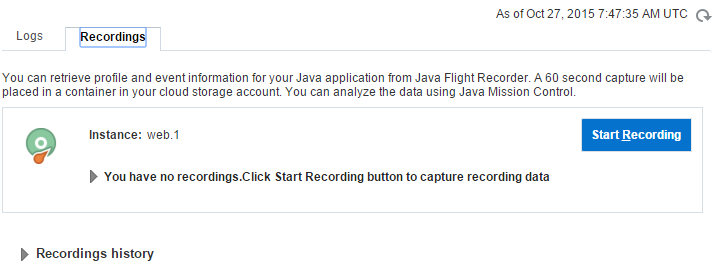

{width="7.781944444444444in"
height="4.377777777777778in"}

  ---------------------------------------------------------------------------
  **DevOps in Oracle’s Application PaaS for Java SE and Node Applications**
  
  Oracle Korea Middleware
  ---------------------------------------------------------------------------

> {width="2.0in"
> height="1.0611111111111111in"}

Contents

[*1* *Before You Begin* 3](#before-you-begin)

[*1.1* *Software Prerequisite* 3](#software-prerequisite)

[*1.2* *Cloud Deployment Summary* 3](#cloud-deployment-summary)

[*1.3* *Developing an Application for Cloud Deployment*
3](#developing-an-application-for-cloud-deployment)

[*1.4* *Configuring Your Application to Run in the Cloud*
4](#configuring-your-application-to-run-in-the-cloud)

[*2* *Creating a Cloud Ready Package Using manifest.json*
5](#creating-a-cloud-ready-package-using-manifest.json)

[*2.1* *Creating a Java Application Archive using Maven*
5](#creating-a-java-application-archive-using-maven)

[*2.2* *The manifest.json File* 6](#the-manifest.json-file)

[*2.3* *Creating the Final Archive* 7](#creating-the-final-archive)

[*3* *Deploying your Application using the Web User Interface*
8](#deploying-your-application-using-the-web-user-interface)

[*4* *Configuring your Application using Web User Interface*
11](#configuring-your-application-using-web-user-interface)

[*5* *Deploying your Application using the REST API*
15](#deploying-your-application-using-the-rest-api)

[*5.1* *Cloud Deployment by Using REST API Summary*
15](#cloud-deployment-by-using-rest-api-summary)

[*5.2* *Creating a CURL Script to Copy the App to the Storage Service*
15](#creating-a-curl-script-to-copy-the-app-to-the-storage-service)

[*5.3* *Creating a CURL Script to Deploy the App*
16](#creating-a-curl-script-to-deploy-the-app)

[*5.4* *Using a deployment.json File* 17](#using-a-deployment.json-file)

[*6* *Updating and Redeploying your Application*
18](#updating-and-redeploying-your-application)

 {#section .ListParagraph}

 {#section-1 .ListParagraph}

 {#section-2 .ListParagraph}

 {#section-3 .ListParagraph}

 {#section-4 .ListParagraph}

 {#section-5 .ListParagraph}

 {#section-6 .ListParagraph}

 {#section-7 .ListParagraph}

 {#section-8 .ListParagraph}

 {#section-9 .ListParagraph}

Before You Begin
================

The Oracle Application Container Cloud can deploy and run Java SE and
Node.js applications. To deploy an application, it must be contained in
a zip or tgz archive file which includes required configuration
information. Once you have the application, you can use either the
Oracle Application Container Cloud graphical user interface or the REST
API to deploy your application.

The purpose of this guide is to introduce you to packaging and deploying
an application to the Oracle Application Container Cloud. The
approximate time to complete this lab is 45 minutes.

This section is mainly important lecture before going hands-on in the
next section.

Software Prerequisite
---------------------

> When deploying an application using the REST API you will need the
> CURL network utility, which you can obtain at http://curl.haxx.se/.

Cloud Deployment Summary
------------------------

> To properly package and deploy your application, you must go through
> the following steps:

1.  Create an application that is *configurable* at runtime. That is, an
    application that’s configuration is read from the environment rather
    than hard coded.

2.  Collect all your application resources including required libraries
    into a *single directory hierarchy or single Java JAR* in
    preparation for deployment archive creation.

3.  Create an application archive that contains your application
    resources *and* a manifest.json in a single file. The manifest.json
    file must be stored in the root directory of your archive.

4.  Deploy your application archive to Oracle Application Container
    Cloud.

Developing an Application for Cloud Deployment
----------------------------------------------

> To properly package, deploy, and execute your application in Oracle
> Application Container Cloud there are a few key concepts you must
> understand:
>
> **Container Considerations**
>
> Oracle Application Container Cloud applications run in Docker
> containers. Docker is an open-source software container project. Think
> of a container as of a lightweight virtual machine. Your application
> runs in its own isolated execution space which has its own memory,
> file system, and network access. So access to these operating system
> resources takes place without the cost of having to implement an
> entire virtual operating system.
>
> When you deploy your application to the Application Container Cloud, a
> container is dynamically generated for your application. The
> implication of this is that all the typical configuration information
> like host name and port number are also dynamically generated.
> Therefore, **any application that runs in this environment must be
> read key configuration information from the environment before the
> application starts.**
>
> Additionally, containers for your application can be dynamically
> allocated to scale up or down as is required by the application load.
> This dynamic scaling feature is made possible by the **load
> balancers** provided by the Application Container Cloud. The balancer
> routes traffic to the application instances thus "balancing" the load.
>
> Given the setup of the service, this has the following implications
> for your applications.
>
> **Application Considerations for Running in a Container**
>
> For an application to run properly on Oracle Application Container
> Cloud, there are a few requirements that must be met.

-   **Applications must be stateless**: Since the service can run
    multiple instances of the same application, applications cannot
    share state. For example, items added to a shopping cart application
    on one instance would not be available to other instances of the
    application. Since application load is balanced between instances,
    there is no guarantee that the next request would be handled by the
    same instance as the last request. Thus trying to store application
    state would result in possible data loss. Therefore, state
    information should be stored outside your application in a database.
    Modern databases are designed to handle connections from multiple
    concurrent clients.

-   **Applications communicate via network ports**: The only way to
    communicate to a running application is through its assigned network
    port.

-   **Applications must be configurable at runtime**: Applications must
    be able to start and execute based on values set by the container.
    Values are passed to an application through environment variables.

-   **All dependencies must be included with the application:** This
    means that if your application requires a library to execute, that
    library must be included with the application archive when it is
    deployed. You can accomplish this in two ways:

    1.  **Create an Uber Jar (Java SE only):** When creating your
        application, all dependent libraries are included in the jar
        with the application.

    2.  **Archived Libraries:** Include dependent libraries in the
        application archive you create. For Java, separate jars can be
        referenced using the CLASSPATH command line option in the
        application launch command. For Node, you should install locally
        required libraries in the node\_modules folder and include them
        in the application archive as well.

Configuring Your Application to Run in the Cloud
------------------------------------------------

> To make your Java SE application run on the Application Container
> Cloud, you must let the container assign the host name and port number
> of your application. These values are set by the container using
> environment variables. Specifically, your application needs to read
> the HOSTNAME and PORT environment variables, then start your
> application using those values.
>
> In Java 8, the new Optional class makes it fairly easy to read these
> values, check for null, and then return the values from the
> environment or default values. What follows is a new version of the
> Main class which checks for the PORT and HOSTNAME environment
> variables at run time. If the values are set, they are used to launch
> the server. If the values are not set, default values are used
> instead. This allows your application to run stand alone locally or in
> the cloud using the service. The example class uses Grizzly and Jersey
> to have an HTTP server exposing JAX-RS.
>
> **Main.java**
>
> package com.example.rest;
>
> import org.glassfish.grizzly.http.server.HttpServer;
>
> import
> org.glassfish.jersey.grizzly2.httpserver.GrizzlyHttpServerFactory;
>
> import org.glassfish.jersey.server.ResourceConfig;
>
> import java.io.IOException;
>
> import java.net.URI;
>
> import java.util.Optional;
>
> /\*\*
>
> \* Main class
>
> \*/
>
> public class Main{
>
> // Base URI the Grizzly HTTP server will listen on
>
> public static final String BASE\_URI;
>
> public static final String protocol;
>
> public static final Optional&lt;String&gt; host;
>
> public static final String path;
>
> public static final Optional&lt;String&gt; port;
>
> static{
>
> protocol = "http://";
>
> host = Optional.ofNullable(System.getenv("HOSTNAME"));
>
> port = Optional.ofNullable(System.getenv("PORT"));
>
> path = "myapp";
>
> BASE\_URI = protocol + host.orElse("localhost") + ":" +
> port.orElse("8080") + "/" + path + "/";
>
> }
>
> /\*\*
>
> \* Starts Grizzly HTTP server exposing JAX-RS resources defined in
> this application.
>
> \* @return Grizzly HTTP server.
>
> \*/
>
> public static HttpServer startServer() {
>
> // create a resource config that scans for JAX-RS resources and
> providers
>
> // in com.example.rest package
>
> final ResourceConfig rc = new
> ResourceConfig().packages("com.example.rest");
>
> // create and start a new instance of grizzly http server
>
> // exposing the Jersey application at BASE\_URI
>
> return
> GrizzlyHttpServerFactory.createHttpServer(URI.create(BASE\_URI), rc);
>
> }
>
> /\*\*
>
> \* Main method.
>
> \* @param args
>
> \* @throws IOException
>
> \*/
>
> public static void main(String\[\] args) throws IOException {
>
> final HttpServer server = startServer();
>
> System.out.println(String.format("Jersey app started with WADL
> available at "
>
> + "%sapplication.wadl\\nHit enter to stop it...", BASE\_URI));
>
> System.in.read();
>
> server.stop();
>
> }
>
> }
>
> A couple of key points:

-   At the top of the class notice two Optional&lt;String&gt; variables
    are declared. The port and host fields will store the result of our
    environment variable lookup.

-   In the static initialization block, the System.getenv method is used
    to get the environment variable. Notice that the Optional.ofNullable
    method is called. This method will return either the value stored in
    the environment variable or an empty Optional if no value is
    returned.

-   The BASE\_URI field now uses the Optional variables to create the
    URI. The orElse method sets a default value if the optional is
    empty.

> With these improvements, you can set the host name or port using
> environment variables. The additional code is clear and concise.

Creating a Cloud Ready Package Using manifest.json
==================================================

> To package your application and get it ready for the cloud, you need
> to combine your application archive with the manifest.json file.

Creating a Java Application Archive using Maven
-----------------------------------------------

> Java applications can employ a single uber JAR as a way to collect all
> application resources and dependencies required to run the
> application. This way, your entire application can be distributed in a
> single file without messy CLASSPATH variables or extra software
> installations. To do this, using Maven, you must change the pom.xml
> file.
>
> If you use the default Maven settings to create a JAR, only the class
> files generated from source file are included in the JAR. This works
> fine when executing an application from Maven since any dependencies
> are downloaded into the local Maven cache. However, this does not
> produce a standalone application file that can be run anywhere. You
> must include the dependencies.
>
> To do this, some changes are required to the pom.xml file. The first
> change to the file is the addition of the assembly plugin.

1.  Locate the pom.xml file in the employees-app sample project provided
    on this lab. Open the file and identify the following snippet of
    code:

> &lt;plugin&gt;\
> &lt;groupId&gt;org.apache.maven.plugins&lt;/groupId&gt;\
> &lt;artifactId&gt;maven-assembly-plugin&lt;/artifactId&gt;\
> &lt;configuration&gt;\
> &lt;descriptorRefs&gt;\
> &lt;descriptorRef&gt;jar-with-dependencies&lt;/descriptorRef&gt;\
> &lt;/descriptorRefs&gt;\
> &lt;finalName&gt;\${project.build.finalName}-\${project.version}&lt;/finalName&gt;\
> &lt;archive&gt;\
> &lt;manifest&gt;\
> &lt;mainClass&gt;com.example.employees.Main&lt;/mainClass&gt;\
> &lt;/manifest&gt;\
> &lt;/archive&gt;\
> &lt;/configuration&gt;\
> &lt;executions&gt;\
> &lt;execution&gt;\
> &lt;phase&gt;package&lt;/phase&gt;\
> &lt;goals&gt;\
> &lt;goal&gt;single&lt;/goal&gt;\
> &lt;/goals&gt;\
> &lt;/execution&gt;\
> &lt;/executions&gt;\
> &lt;/plugin&gt;
>
> The **assembly** plugin is typically used to create JAR or WAR files
> that package Java applications into a file. Notice that the Main class
> is set so that an executable JAR is created. Doing this allows the JAR
> file to execute using the java -jar command line option. Also note
> that the finalName value has been updated to match the rest of the
> project and that by adding
> &lt;descriptorRef&gt;jar-with-dependencies&lt;/descriptorRef&gt; the
> required libraries for the application are added to the jar.

The manifest.json File
----------------------

> The manifest.json file provides metadata about your Java application.
> This information includes the version of Java and the command used to
> execute the application. You can also include notes about your
> application along with release information:
>
> {\
> "runtime": {\
> "majorVersion": "7"\
> },\
> "command": "bash -l start.sh",\
> "release": {\
> "build": "150520.1154",\
> "commit": "d8c2596364d9584050461",\
> "version": "15.1.0"\
> },\
> "notes": "notes related to release"\
> }
>
> In the example above you can see the following JSON properties:

-   **runtime**:

    -   **majorVersion**: version of the runtime e.g. for Java it would
        be 7 or 8

-   **command**: Command to execute after deploying the application

-   **release**:

    -   **build**: User specified text value identifying this build

    -   **commit**: User specified text value related to this commit

    -   **version**: Version text string maintained by user

> A very minimal manifest.json file would look like this:
>
> {\
> "runtime": {"majorVersion": "7"},\
> "command": "bash -l start.sh"\
> }

1.  Locate the manifest.json file sample file provided on this lab. Open
    the file and identify the following snippet of code:

> {
>
> "runtime": {
>
> "majorVersion": "8"
>
> },
>
> "command": "java -jar
> employees-app-1.0-SNAPSHOT-jar-with-dependencies.jar",
>
> "release": {
>
> "build": "2015-09",
>
> "commit": "commitString",
>
> "version": "v2.0"
>
> },
>
> "notes": "Oracle Sample Application - Web application Bootstrap"
>
> }
>
> **Note:** This is an uber JAR deployment given the simplicity of the
> command to launch the application. This application also uses Java
> version 8. If your application needs any special command line switches
> to run, this is where you would specify them.

Creating the Final Archive
--------------------------

> As a final step, you create an archive containing the application
> archive and manifest.json. Both files are stored at the root level of
> the archive file.

1.  Select the manifest.json ,
    employees-app-1.0-SNAPSHOT-jar-with-dependencies.jar files and
    create a zip file with them. You can just right click after
    selecting them and select the **Send to -&gt; Compressed (zipped
    folder)** option. Make sure to name the archive
    employees-web-app.zip.

> Optionally, you can use the zip command:
>
> zip employees-web-app.zip manifest.json
> employees-app-1.0-SNAPSHOT-jar-with-dependencies.jar
>
> You can also use the tar command:
>
> tar cvfz employees-web-app.tgz manifest.json
> employees-app-1.0-SNAPSHOT-jar-with-dependencies.jar
>
> The resulting archive file employees-web-app.zip has the following
> structure:
>
> /
>
> |---&gt; manifest.json
>
> |---&gt; employees-app-1.0-SNAPSHOT-jar-with-dependencies.jar
>
> **Note**: Both files **are contained in the root directory** of the
> archive file.
>
> Once you have packaged your application for deployment on Oracle
> Application Container Cloud, you are ready to deploy it. The steps for
> deploying your application are next.

Deploying your Application using the Web User Interface
=======================================================

This section describes the steps to deploy a Java SE application to
Oracle Application Container Cloud using the web user interface.

1.  To deploy an application to Oracle Application Container Cloud,
    package your application in a zip or tgz file. Or, you can use the
    zip application provided in this tutorial and explore the user
    interface using this prepackaged application.

2.  Log into the Application Container Cloud with your credentials.

> {width="4.423611111111111in"
> height="2.610913167104112in"}
>
> The application list view is displayed.
>
> {width="5.055555555555555in"
> height="1.8445942694663167in"}

1.  Click the **Create Application** button. A choice of what kind of
    application is displayed (Java SE or Node).

> {width="1.065987532808399in"
> height="0.7222222222222222in"}

1.  Select Java SE for the application. The **Create Application**
    dialog appears.

> {width="3.2346489501312337in"
> height="2.6555555555555554in"}

1.  Enter a name for your Application.

2.  Select the subscription type (Monthly or Hourly).

3.  Click **Browse** button in the Application Archive field.

> {width="2.367333770778653in"
> height="0.5888888888888889in"}
>
> The **Application Archive** dialog is displayed.
>
> {width="4.6930555555555555in"
> height="1.641353893263342in"}

1.  Select **Upload application archive**.

2.  Click **Choose File** and select the employees-web-app.zip file you
    created in the previous section. Click **OK**.

> {width="5.068210848643919in"
> height="1.7944444444444445in"}

1.  Once you are back on the **Create Application** dialog, enter any
    notes you may be about the application in the **Notes** field.

<!-- -->

1.  Review the number of instances and memory size for your application
    in the **Instance** section. Make any adjustments you feel are
    necessary.

2.  Click **Create** to deploy your application to Oracle Application
    Container Cloud.

> {width="3.845833333333333in"
> height="4.094738626421697in"}
>
> After a few seconds, your application should be deployed on the Oracle
> Application Container Cloud.
>
> {width="3.6791666666666667in"
> height="0.6875207786526684in"}
>
> The **Overview** tile will appear next giving you an overview of your
> application.
>
> {width="4.143561898512686in"
> height="3.672222222222222in"}

Configuring your Application using Web User Interface
=====================================================

After your application is deployed, there are a number of configuration
views available to you. Each one provides you with detailed
configuration options and information about your current configuration
settings.

1.  Click the **Overview** tile on the left side menu.

> {width="1.6584962817147857in"
> height="1.1666666666666667in"}

The Overview view is displayed:

{width="4.018055555555556in"
height="3.213718285214348in"}

> The **Overview** view is the default view for an application. This
> view shows information about the number of running instances, the
> memory size of each instance and other data related to your
> application. The sections included in **Overview** view are:

-   **Resources**: Detailed information about the number of instances
    the amount of memory assigned to each instance.

> {width="1.4770625546806648in"
> height="0.8777777777777778in"}

-   **Instances**: A graphical representation of each instance.

> {width="4.756944444444445in"
> height="0.9602799650043744in"}

-   **Activity**: Information about the time of the last operation.

> {width="4.673611111111111in"
> height="0.8378455818022748in"}

-   **Additional Information**: Shows metadata related to the
    application. Includes things like Java version, date and time
    deployed, and identity domain.

> {width="2.2326968503937006in"
> height="1.3277777777777777in"}

-   **Status**: Shows the current status of the application.

> {width="2.477777777777778in"
> height="0.9in"}

1.  Click the **Deployments** tile on the left side menu.

> {width="1.7791666666666666in"
> height="1.207292213473316in"}
>
> The Deployments view is displayed:
>
> {width="4.4855282152230975in"
> height="3.1333333333333333in"}
>
> {width="4.504677384076991in"
> height="1.711111111111111in"}
>
> The **Deployments View** provides detailed information about the
> current applications deployment. Information shown here includes
> service bindings to other cloud services, global environment
> variables, and the launch command used to start your instances. The
> following sections are included in this view:

-   **Deployments**: This section shows metadata about the deployment.
    This includes information like archive name and archive size.

-   **Service Bindings**: This section specifies service information
    about other cloud services this application connects too. For
    example, if a database service is required for the application, the
    host name and login information would be specified here.

-   **Global Environment Variables**: This sections list global
    environment variables that are available to each of your instances.

-   **Launch Command**: This section shows the launch command used to
    start each application instance.

-   **Deployment History**: This section keeps a record of the
    configuration files used for each application instance. The
    manifest.json and deployment.json files are stored here. In
    addition, a historical record of past configuration files is also
    kept.

1.  Click the **Logs & Recordings** tile on the left side menu.

> {width="1.7569444444444444in"
> height="1.2344958442694662in"}
>
> The **Logs** tab is displayed:
>
> {width="5.229166666666667in"
> height="1.7783989501312336in"}
>
> The logs tab allows you to generate the log file from your instances
> and then download that log to your local machine. The tab also
> includes a history of when logs have been captured.

1.  Click the **Recordings** tab.

> {width="2.584722222222222in"
> height="1.6693000874890638in"}
>
> The Recordings tab content is displayed.
>
> {width="4.6625in"
> height="1.7565102799650043in"}
>
> The Recording Tab allows you to record 1 minute of performance data
> from your application using Java Flight Recorder. You can then
> download the recording to your local machine and analyze it using Java
> Mission Control.

Deploying your Application using the REST API
=============================================

This section describes the steps to deploy your Java SE application to
Oracle Application Container Cloud using the REST API. Typically, this
is accomplished using the CURL network utility. CURL can run on any of
the major operating systems (Windows, Mac OS X, or Linux).

Cloud Deployment by Using REST API Summary
------------------------------------------

> The steps needed to deploy the sample application to Oracle
> Application Container Cloud are the following.
>
> **Note**: It is assumed that you have installed CURL on the system you
> are using to deploy this sample application.

1.  Create a properly packaged version of your application (.zip or
    .tgz). Or, you can use the sample zip file provided on this tutorial
    and test the following CURL scripts using this prepackaged
    application.

2.  Create CURL scripts to upload your application to the **Oracle
    Application Container Cloud Storage** service.

3.  Execute the CURL scripts and upload your application to the storage
    service.

4.  Create a CURL script to deploy your archive.

5.  Execute the CURL script. After executing the script, your
    application should be deployed on Oracle Application Container
    Cloud.

Creating a CURL Script to Copy the App to the Storage Service
-------------------------------------------------------------

> Before you can deploy your application, you must first copy it to the
> storage service. You can obtain the required information you need to
> copy the file from Oracle Application Container Cloud. Once you have
> the login information and host name execute a CURL script that uses
> the following format.
>
> Here are the values used in the example.
>
> **Storage**

-   **Storage ID Domain**: johndoeStorage

-   **Storage User ID**: johndoeSt

-   **Storage Password**: johnStpassword

> **Additional Data**

-   **App Name**: EmployeeWebApp

-   **Archive file name**: employees-web-app.zip

-   **Path to local file**: target/employees-web-app.zip

-   **Username**: johndoe

-   **Password**: johnpassword

-   **Identity Domain**: john-acct01

-   **Hostname**: apaas.oraclecloud.com

1.  Run the following script to create a storage container.

> \# CREATE STORAGE CONTAINER
>
> curl -i -X PUT \\
>
> -u johndoeSt:johnStpassword \\
>
> https://storage.oraclecloud.com/v1/Storage-johndoeStorage/EmployeeWebApp
>
> The syntax of the command is the following:
>
> \# CREATE STORAGE CONTAINER
>
> curl -i -X PUT \\
>
> -u ***Storage-User-ID:Storage-Password*** \\
>
> https://***hostname***/v1/Storage***-Storage-Id-Domain***/***App-Name***
>
> Once the storage container has been created, you can upload your
> archive to the container.

1.  Run the following script to deploy to the Oracle Application
    Container Cloud.

> \# PUT ARCHIVE IN STORAGE CONTAINER
>
> curl -i -X PUT \\
>
> -u johndoeSt:johnStpassword \\
>
> https://storage.oraclecloud.com/v1/Storage-johndoeStorage/EmployeeWebApp/
> employees-web-app.zip -T target/ employees-web-app.zip
>
> The syntax of the command is the following:
>
> \# PUT ARCHIVE IN STORAGE CONTAINER
>
> curl -i -X PUT \\
>
> -u ***User-Name:Password*** \\
>
> https://***host-name***/v1/Storage***-Storage-ID-Domain***/***App-Name***/***Archive-File-Name***
> -T ***Path-to- local-file/Archive-File-Name***

Creating a CURL Script to Deploy the App
----------------------------------------

> To deploy an application using the REST API, your script needs to
> include some standard information.

1.  Run the following deployment script.

> \# Deployment Script
>
> url -i -X POST \\
>
> -u johndoe:johnpassword \\
>
> -H "X-ID-TENANT-NAME:john-acct01" \\
>
> -H "Content-Type: multipart/form-data" \\
>
> -F "name=EmployeeWebApp" \\
>
> -F "runtime=java" \\
>
> -F "subscription=Monthly" \\
>
> -F "deployment=@deployment.json" \\
>
> -F "archiveURL=EmployeeWebApp/employees-web-app.zip" \\
>
> -F "notes=REST app for testing" \\
>
> https://apaas.oraclecloud.com/paas/services/apaas/api/v1.1/apps/john-acct01
>
> After running this script, your application should be deployed on
> Oracle Application Container Cloud. Go to the web GUI to view any
> application details.
>
> The following is a sample script with place holders for the
> information you must provide.
>
> \# Mock Deployment Script
>
> url -i -X POST \\
>
> -u User-Name:Password \\
>
> -H "X-ID-TENANT-NAME:Identity-Domain" \\
>
> -H "Content-Type: multipart/form-data" \\
>
> -F "name=App-Name" \\
>
> -F "runtime=java" \\
>
> -F "subscription=Monthly" \\
>
> -F "deployment=@deployment.json" \\
>
> -F "archiveURL=App-name/Archive-File-Name" \\
>
> -F "notes=Your Notes here" \\
>
> https://hostname/paas/services/apaas/api/v1.1/apps/Identity-Domain
>
> Here are a few key points about this example:

-   **-H** specifies headers that are added to the HTTP request.

-   **-F** allows curl to submit data like it is coming from a form.
    Thus the POST as the HTTP method.

-   **archiveURL** specifies where your archive file is located. Notice
    the URL is made up of your application name, a "/" and the archive
    file name.

> **Note**: Rather than using default values for your application, a
> deployment.json file can be specified at deployment.

Using a deployment.json File
----------------------------

> When deploying using the REST API you have the option of referring to
> a deployment.json file. The file provides configuration settings for
> the container your application runs in. These settings include the
> memory size of the application and specific information about the
> environment.

1.  Create a JSON file with name deployment.json, with the following
    content:

> {
>
> "memory": "2G",
>
> "instances": "1",
>
> "environment":{
>
> "TEST\_ENV\_VAR": "TestValue"
>
> }
>
> }

1.  Run the following deployment script.

> \# Deployment Script
>
> url -i -X POST \\
>
> -u johndoe:johnpassword \\
>
> -H "X-ID-TENANT-NAME:john-acct01" \\
>
> -H "Content-Type: multipart/form-data" \\
>
> -F "name=EmployeeWebApp" \\
>
> -F "runtime=java" \\
>
> -F "subscription=Monthly" \\
>
> -F "deployment=@deployment.json" \\
>
> -F "archiveURL=EmployeeWebApp/employees-web-app.zip" \\
>
> -F "notes=REST app for testing" \\
>
> https://apaas.oraclecloud.com/paas/services/apaas/api/v1.1/apps/john-acct01
>
> When the application is deployed, the settings defined in the file are
> used to deploy the app.
>
> If we have the following deployment.json file:
>
> {
>
> "memory": "2G",
>
> "instances": "1",
>
> "environment": {
>
> "NO\_OF\_CONNECTIONS":"25",
>
> "TWITTER\_ID":"JAVA"
>
> },
>
> "services": \[{
>
> "identifier": "ProdService",
>
> "name": "Jaas Service",
>
> "type": "JAAS"
>
> "username": "username",
>
> "password": "\*\*\*"
>
> }\]
>
> }
>
> Then the JSON fields are defined as follows:

-   **memory**: Defines the size of the applications container. Values
    accepted 1G to 7G.

-   **instances**: Number of application instances to run.

-   **notes**: Notes about the deployment plan.

-   **environment**:

    -   **key**: Name of an environment variable used by the
        application.

    -   **value**: Value of the environment variable used by the
        application.

-   **services**

    -   **identifier**: Identifier given by user

    -   **name**: Name of the service

    -   **type**: Type of the service

    -   **username**: Username used to access service(OPTIONAL)

    -   **password**: Password for the service(OPTIONAL)

Updating and Redeploying your Application
=========================================

In addition to deploying your application, you can update its
configuration settings or redeploy the entire application.

1.  Run the following command to update the deployment configuration of
    the application.

> curl -X PUT \\
>
> -u johndoe:johnpassword \\
>
> -H "X-ID-TENANT-NAME:john-acct01" \\
>
> -H "Content-Type: multipart/form-data"\\
>
> -F deployment=@deployment.json" \\
>
> -F "notes=notes for deployment" \\
>
> https://apaas.oraclecloud.com/paas/service/apaas/api/v1.1/apps/john-acct01/
>
> EmployeeWebApp
>
> Note at the end of the URL the Identity Domain and App name are used
> to specify what gets updated. The deployment.json file contains your
> changes to the configuration. Changes will restart your application or
> start new instances.

1.  Run the following command to redeploy and update the entire
    application.

> curl -X PUT \\
>
> -u johndoe:johnpassword \\
>
> -H "X-ID-TENANT-NAME:john-acct01" \\
>
> -H "Content-Type: multipart/form-data"\\
>
> -F "deployment=@deployment.json" \\
>
> -F "archiveURL=/path-to-myapp/jersey-service-intro.zip" \\
>
> -F "notes=notes for deployment" \\
>
> https://apaas.oraclecloud.com/paas/service/apaas/api/v1.1/apps/john-acct01/
> EmployeeWebApp
>
> Note at the end of the URL the Identity Domain and App name are used
> to specify what gets updated. The deployment.json file
>
> contains your changes to the configuration, but the file is not
> required. If you wish to leave the deployment setting at their current
>
> value do not specify a file. In this case you application will
> restart.

You have completed this Lab.
