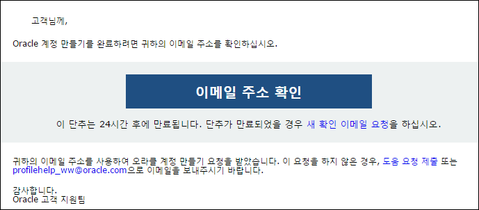

오라클 Cloud 접속
=================

오라클 클라우드 Trial을 신청하기 위해 다음 사이트에 접속한다.

-   <https://cloud.oracle.com/ko_KR/home> 에 접속

우측 상단의 “무료체험” 버튼을 클릭한다.

Trial 페이지 이동
=================

여기에서 무료로 시작하기를 누르면 화면에 나오는 4번의 과정을 거치게 되는데,
아래의 링크를 누르면 skip하게 되므로 아래의 링크를 클릭한 후 “3. 회원가입”으로
이동한다.
<https://myaccount.cloud.oracle.com/mycloud/faces/trialsignup.jspx?serviceType=IAASMB>

회원가입
========

기존에 사용하던 오라클 계정이 있을 경우 로그인을 한다.

오라클 계정이 있는 경우 “3. 회원가입”은 생략한다.

오라클 계정이 없는 경우 ‘계정 만들기’를 클릭하여 오라클 계정을 생성한다.

가입 후에는 확인 메일이 발송된다.

메일에서 ‘이메일 주소 확인’ 버튼을 클릭하여 메일 주소를 인증한다.

이메일 주소 확인 버튼을 누르면 다음과 같이 trial 을 신청하는 페이지로 이동하게
된다.

Trial 신청
==========

다음 화면에서 정확한 정보를 입력한다.

입력한 핸드폰 번호로 인증번호를 받아야 하므로 국제전화로 오는 메시지를 차단하지
않아야 한다.

Create New Account하단의 빈 text box에 입력하는 내용이 향후 Identity Domain에
사용할 내용이다.

기록한 내용을 잘 기억하도록 한다.

“Sign Up”을 클릭한다

요청한 내용이 맞는지 Confirmation 화면에서 다시 확인 한다.

여기까지 완료하면 계정 생성에 사용한 메일로 Trial 승인 메일이 보내질 것이다.
(길게는 **몇 시간** 정도 소요될 수 있다)

아래와 같은 메일이 도착했는지 확인한다.

My Services URL에 접속한다.

이메일의 Username과 *임시 패스워드*로 로그인한다.

처음 접속 시 임시 패스워드를 변경한다.

접속 후 My Service Dashboard에 들어가게 된다.

아래 Dashboard에는 Java Cloud Service와 Database Cloud Service가 보이지 않으므로
“Customize Dashboard” 메뉴를 선택하여 “Database”와 “Java”를 Dashboard에
추가한다.

Dashboard가 다음과 같이 보이게 한다.

스토리지 복제 정책 설정
=======================

스토리지 복제 정책을 설정하기 위해 스토리지 링크를 클릭한다.

상단의 “서비스 콘솔 열기” 링크를 클릭한다.

복제 정책을 설정하는 화면이 나오는데, 여기서는 default로 되어 있는
uscom-central-1을 선택하고 Set Policy를 클릭한다.

