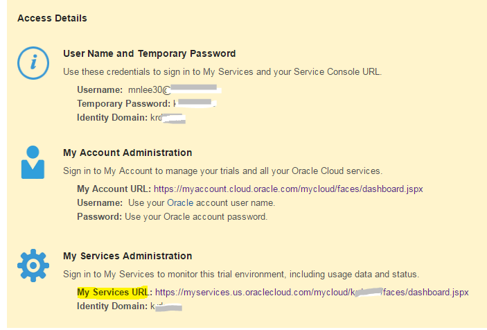
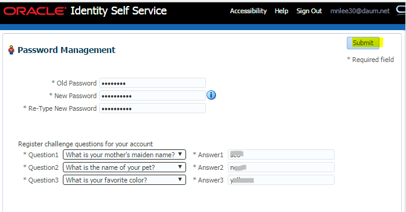
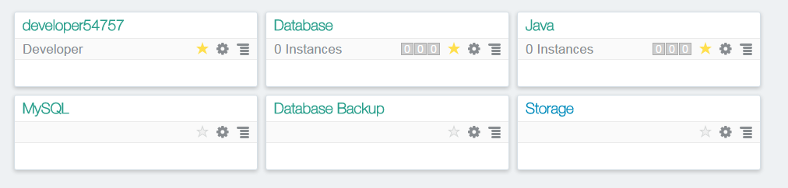
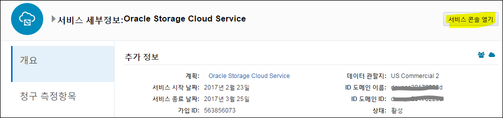
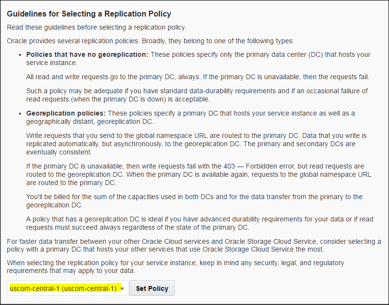

Oracle Cloud에 접속
===================

Subscribe한 서비스 정보를 확인하고 제공된 My Services URL에 접속한다.

이메일의 Username과 *임시 패스워드*로 로그인한다.

처음 접속 시 임시 패스워드를 변경한다.

접속 후 My Service Dashboard에 들어가게 된다.

아래 Dashboard에는 Java Cloud Service와 Database Cloud Service가 보이지 않으므로
“Customize Dashboard” 메뉴를 선택하여 “Database”와 “Java”를 Dashboard에
추가한다.

Dashboard가 다음과 같이 보이게 한다.

스토리지 복제 정책 설정
=======================

스토리지 복제 정책을 설정하기 위해 스토리지 링크를 클릭한다.

상단의 “서비스 콘솔 열기” 링크를 클릭한다.

복제 정책을 설정하는 화면이 나오는데, 여기서는 default로 되어 있는
uscom-central-1을 선택하고 Set Policy를 클릭한다.

DBCS 프로비저닝
===============

Database Provisioning을 위해 Database Service Console에 들어간다

처음 접속 화면에서 “Go To Console”을 클릭한다

“Create Service” 버튼 클릭

서비스 명을 다음과 같은 이름으로 입력한다 (같은 이름으로 생성한다. 다른 이름으로
생성시 Lab이 정상동작 하지 않을 수 있음)

DB이름(SID)는 AlphaDB로 한다.

Usable Database Storage(GB)를 **15**로 설정한다.

관리 비밀번호를 “**Welcome1\#**”로 입력한다(다른 패스워드로 입력 시 lab에서
제공하는 script에서 수동으로 패스워드를 수정하는 작업을 해줘야 한다.)

SSH 공용키를 생성하기 위해 편집 버튼을 누른다. Public Key를 새로 만드는 것으로
선택한다.

Key를 다운 받아 둔다

아래 설정한 옵션대로 선택하고

Cloud Storage Container는 다음 규칙에 맞게 입력한다.

Storage-**identitydomain**/DBContainer

-   **identitydomain** 부분만 각자에게 할당된 identity domain으로 변경하면 된다

-   identity domain이 kroracle이라면 Storage-kroracle/DBContainer 라고 입력하면
    된다

Cloud Storage User Name은 Dashboard에 로그인한 Username과 Password를 사용하면
된다.

다음 항목은 default로 두고 “Next”를 클릭한다.

Confirm 화면에서 정보가 잘 입력되었는지 확인 후 “Create”를 클릭한다.

DB가 프로비저닝 되는지 확인한다.

프로비저닝 상세는 Activity 메뉴에서 확인할 수 있다.

완료가 되면 상태가 Succeeded가 된다. 이 과정이 약 30분 정도 소요된다.

